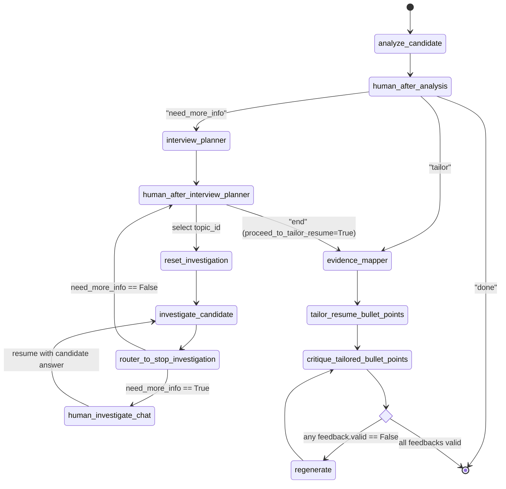

# Resume Analysis Agent — Backend Architecture & System Design

## 1. Executive Summary & Product Alignment

The **Resume Analysis Agent** is designed to address a critical flaw in current AI resume tools: automated tools tend to prioritize speed over context, generating superficial customizations that fail to represent the candidate's authentic experience.

Based on [PRD.md](file:///D:/Documents/resume-agent/PRD.md), the system implements an interactive, evidence-based AI workflow. Rather than blindly rewriting resumes, the agent:
1. Ingests the candidate's resume (DOCX) and a target job listing (via LinkedIn, Indeed, Workday URL scraping, or direct job description text paste).
2. Parses paragraphs and structures the resume into a typed, validated data schema ([`ResumeStructure`](file:///D:/Documents/resume-agent/backend/model/job_pydantic.py#L95-L103)).
3. Performs an evidence-based gap analysis strictly anchored to verifiable experience.
4. Formulates a targeted investigation plan to probe identified gaps.
5. Executes a conversational Human-in-the-Loop (HITL) interview to extract concrete metrics, scope, ownership, and technologies from the candidate, resetting topic-specific chat history per session while preserving an accumulated evidence bank.
6. Maps verified evidence back to specific resume experiences and projects ([`evidence_mapper`](file:///D:/Documents/resume-agent/backend/agent/nodes/tailor_agent.py#L7-L70)).
7. Proposes justified resume bullet point improvements (KEEP, MODIFY, ADD) formatted with XYZ achievement syntax ([`tailor_resume_bullet_points`](file:///D:/Documents/resume-agent/backend/agent/nodes/tailor_agent.py#L73-L216)).
8. Validates proposed bullets through an automated factuality critic ([`critique_tailored_bullet_points`](file:///D:/Documents/resume-agent/backend/agent/nodes/tailor_agent.py#L224-L301)) and iterative correction loop ([`regenerate_bullets`](file:///D:/Documents/resume-agent/backend/agent/nodes/tailor_agent.py#L303-L386)) to eliminate hallucinations.
9. *(Planned Future Step)* Optimizes human-approved, verified bullets for Applicant Tracking Systems (ATS) keyword alignment and formatting.

### Scope Demarcation (Implementation Status)

| Feature / Capability | Status in Current Implementation | PRD Alignment |
| :--- | :--- | :--- |
| **DOCX Resume Ingestion & Parsing** | Implemented (`python-docx` + LLM extraction into `ResumeStructure`) | Current MVP |
| **Job URL Ingestion & Scraping** | Implemented (`trafilatura` + `httpx` for LinkedIn, Indeed, Workday) | Current MVP |
| **Direct Job Description Paste Fallback** | Implemented (Direct text input + scraping error fallback) | Current MVP |
| **LLM Job Description Validation** | Implemented (Structured extraction via GPT-4o in `resume_pre_llm.py`) | Current MVP |
| **Candidate Gap & Fit Analysis** | Implemented (`CandidateAnalysis` structured prompt in `analyzation.py`) | Current MVP |
| **Interactive Interview Planning & Chat**| Implemented (LangGraph state machine + `interrupt` loops) | Current MVP |
| **Topic Context Resetting & Evidence Accumulation** | Implemented (`reset_investigation` + `evidence_with_details` bank) | Current MVP |
| **Evidence Provenance Mapping** | Implemented (`evidence_mapper` node in `tailor_agent.py`) | Tailoring Pipeline |
| **Resume Bullet Point Tailoring** | Implemented (`tailor_resume_bullet_points` in `tailor_agent.py`) | Tailoring Pipeline |
| **Tailored Bullet Factuality Critique** | Implemented (`critique_tailored_bullet_points` in `tailor_agent.py`) | Tailoring Pipeline |
| **Self-Correction & Regeneration Loop** | Implemented (`regenerate_bullets` node in `tailor_agent.py`) | Tailoring Pipeline |
| **ATS Optimization Agent** | Planned Final Step (Runs after human approval to optimize for ATS) | Planned Roadmap |
| **Direct Application Submission** | Explicitly Excluded | Non-goal |
| **External DB & Vector Storage (RAG)**| Stubs only (`repository/`, `bucket/` empty) | Future Phase |
| **PDF & Plaintext Parsing** | Rejected by API validation (`HTTP 400`) | Future Phase |

---

## 2. High-Level Architecture Overview

The backend is built as an asynchronous Python service using **FastAPI** for HTTP ingestion, **CORS Middleware** configured for the frontend (`http://localhost:3000`), and **LangGraph** (with **LangChain** and **OpenAI GPT-4o**) for stateful orchestration with SQLite checkpointer persistence ([`AsyncSqliteSaver`](file:///D:/Documents/resume-agent/backend/data/app.db)).

```mermaid
graph TD
    User([Candidate / Frontend Client]) -->|POST /tailor/upload| API_Upload[FastAPI: /tailor/upload]
    User -->|POST /tailor/chat| API_Chat[FastAPI: /tailor/chat]
    User -->|GET /tailor/session/{session_id}| API_Session[FastAPI: /tailor/session/{id}]

    subgraph Service_Layer [Service Layer]
        API_Upload --> DocParser[Document Parser\n(services/document_parser.py)]
        API_Upload --> JobFetcher[Job Fetcher\n(services/job_fetcher.py)]
        DocParser --> PreLLM[Resume & Job Structurer\n(services/resume_pre_llm.py)]
        JobFetcher --> PreLLM
        API_Upload --> AnalysisService[Resume Analysis Service\n(services/resume_analysis_service.py)]
    end

    subgraph LangGraph_Runtime [LangGraph Orchestration Runtime]
        API_Upload -->|initialize_tailoring_session| GraphEngine[StateGraph Engine]
        API_Chat -->|resume_tailoring_session| GraphEngine
        API_Session -->|get_session_state| GraphEngine
        GraphEngine <--> Checkpointer[(AsyncSqliteSaver\nbackend/data/app.db)]
        
        subgraph Graph_Nodes [Agent State Graph]
            AnalyzeNode[analyze_candidate]
            HumanAnalysis[human_after_analysis\n(interrupt)]
            PlannerNode[interview_planner]
            HumanPlanner[human_after_interview_planner\n(interrupt)]
            ResetInvestigate[reset_investigation]
            InvestigateNode[investigate_candidate]
            HumanChat[human_investigate_chat\n(interrupt)]
            EvidenceMapperNode[evidence_mapper]
            TailorNode[tailor_resume_bullet_points]
            CritiqueNode[critique_tailored_bullet_points]
            RegenerateNode[regenerate_bullets]
            ATSNode[ats_optimizer\n(planned final step)]
        end
    end

    subgraph External_Integrations [External Services]
        OpenAI[OpenAI API\ngpt-4o]
        LangSmith[LangSmith Tracing]
        JobSites[LinkedIn / Indeed / Workday]
    end

    PreLLM --> OpenAI
    AnalyzeNode --> OpenAI
    PlannerNode --> OpenAI
    InvestigateNode --> OpenAI
    EvidenceMapperNode --> OpenAI
    TailorNode --> OpenAI
    CritiqueNode --> OpenAI
    RegenerateNode --> OpenAI
    JobFetcher --> JobSites
    GraphEngine -.-> LangSmith
```

---

## 3. End-to-End Data Flow

The system operates across three primary interaction phases: Ingestion & Fit Analysis, Conversational Investigation with Context Reset, and Provenance Mapping, Tailoring & Factuality Verification.

```mermaid
sequenceDiagram
    autonumber
    actor User as Client / Frontend UI
    participant API as FastAPI Router (/tailor)
    participant Svc as Analysis Services
    participant Graph as LangGraph Engine
    participant DB as SQLite Checkpointer (app.db)
    participant LLM as OpenAI (GPT-4o)

    Note over User, LLM: Phase 1: Upload & Initial Analysis
    User->>API: POST /tailor/upload (DOCX file, job_link OR job_description)
    API->>Svc: process_resume_analysis(file_bytes, job_url, job_description)
    alt Scraper Error / Insufficient Text (<200 chars)
        Svc-->>API: {success: false, requires_job_description: true, error: "..."}
        API-->>User: 200 OK: Prompt user to paste job description
    else Valid Content
        Svc->>Svc: parse_resume(file_bytes) -> sentences
        Svc->>LLM: validate_job_details(job_text) -> JobDetails
        Svc->>LLM: structure_resume_data(sentences) -> ResumeStructure
        Svc-->>API: {success: true, structured_resume, job_details}
        API->>Graph: initialize_tailoring_session(session_id, structured_resume, job_details)
        Graph->>LLM: analyze_candidate(resume, job_details)
        LLM-->>Graph: CandidateAnalysis (fit score, strengths, gaps)
        Graph->>Graph: human_after_analysis (triggers interrupt)
        Graph->>DB: Save thread checkpoint (thread_id=session_id)
        Graph-->>API: Raw interrupt snapshot (__interrupt__)
        API-->>User: 200 OK: session_id + candidate review options ("done", "need_more_info", "tailor")
    end

    Note over User, LLM: Phase 2: Conversational Investigation Loop
    User->>API: POST /tailor/chat (session_id, user_message="need_more_info")
    API->>Graph: resume_tailoring_session(session_id, Command(resume="need_more_info"))
    Graph->>DB: Load thread checkpoint
    Graph->>Graph: router_after_analysis -> routes to interview_planner
    Graph->>LLM: interview_agent(job_details, candidate_analysis, resume_data)
    LLM-->>Graph: InterviewPlan (targeted gap topics)
    Graph->>Graph: human_after_interview_planner (triggers interrupt)
    Graph->>DB: Save thread checkpoint
    Graph-->>API: Normalized response (interrupt: {type="investigation_selection", options})
    API-->>User: 200 OK: options to select topic_id or "end"

    User->>API: POST /tailor/chat (session_id, user_message=selected_topic_id)
    API->>Graph: resume_tailoring_session(session_id, Command(resume=topic_id))
    Graph->>Graph: route_investigation_or_tailoring -> reset_investigation
    Graph->>Graph: reset_investigation (wipes previous topic messages via RemoveMessage)
    Graph->>Graph: transitions to investigate_candidate
    
    loop Investigation Chat
        Graph->>LLM: investigate_candidate (ONE question; uses conversation_history + accumulated evidence_with_details)
        LLM-->>Graph: InvestigateOutput (need_more_info, user_message, evidence)
        alt need_more_info == True
            Graph->>Graph: human_investigate_chat (triggers interrupt)
            Graph->>DB: Save thread checkpoint
            Graph-->>API: Normalized response (interrupt: {type="investigation_chat", message})
            API-->>User: 200 OK: question prompt
            User->>API: POST /tailor/chat (session_id, user_message=candidate_answer)
            API->>Graph: resume_tailoring_session (resume=answer)
            Graph->>Graph: returns to investigate_candidate
        else need_more_info == False (Sufficient Evidence Gathered)
            Graph->>Graph: Append evidence to evidence_with_details
            Graph->>Graph: Append topic_id to completed_topic_ids
            Graph->>Graph: router_to_stop_investigation -> human_after_interview_planner
            Graph-->>API: Normalized response with remaining topics or "end"
            API-->>User: 200 OK: updated topic list
        end
    end

    Note over User, LLM: Phase 3: Resume Tailoring & Factuality Verification
    User->>API: POST /tailor/chat (session_id, user_message="end" OR "tailor")
    API->>Graph: resume_tailoring_session(session_id, Command(resume="end"))
    Graph->>Graph: routes to evidence_mapper
    Graph->>LLM: evidence_mapper(evidence_with_details, resume_data)
    LLM-->>Graph: EvidenceMappingResult (MATCHED vs UNMATCHED provenance)
    Graph->>LLM: tailor_resume_bullet_points(evidence_mapping, resume_data)
    LLM-->>Graph: TailorAnalysis (tailor_matched_list + tailor_unmatched_list)
    
    loop Factuality Verification Loop
        Graph->>LLM: critique_tailored_bullet_points(proposals, evidence_with_details)
        LLM-->>Graph: Feedbacks (list of {valid, suggestions, topic_id})
        alt Any feedback.valid == False
            Graph->>Graph: router_to_generate -> regenerate_bullets
            Graph->>LLM: regenerate_bullets (corrects unsupported claims using critic suggestions)
            LLM-->>Graph: RegeneratedBulletsList (updates proposals in-place)
            Graph->>Graph: returns to critique_tailored_bullet_points
        else All feedback.valid == True
            Graph->>Graph: router_to_generate -> END
        end
    end
    Graph->>DB: Save final state checkpoint
    Graph-->>API: Normalized response (stage="completed", result={...tailor_analysis, feedbacks})
    API-->>User: 200 OK: Verified tailored bullet points & new experience proposals
```

---

## 4. LangGraph State Machine Specification

The core business logic is encapsulated in a compiled `StateGraph(AgentState)` saved to SQLite.

### 4.1 State Schema ([`AgentState`](file:///D:/Documents/resume-agent/backend/agent/state.py#L10-L40))

Defined in [`backend/agent/state.py`](file:///D:/Documents/resume-agent/backend/agent/state.py):

| Field | Type | Reducer | Description |
| :--- | :--- | :--- | :--- |
| `messages` | `Sequence[BaseMessage]` | `add_messages` | Global conversation/agent messages. |
| `resume_data` | `ResumeStructure` | None (overwrite) | Structured, typed resume data (work experience, projects, leadership, education, skills). |
| `job_details` | `JobDetails` | None (overwrite) | Structured, validated job details. |
| `candidate_analysis` | `CandidateAnalysis` | None (overwrite) | Baseline gap, strength, and match score assessment. |
| `candidate_profile_data`| `Optional[dict]` | None (overwrite) | Extended profile background (currently `None` in API). |
| `human_next_action` | `Optional[str]` | None (overwrite) | Selection from `candidate_review` interrupt (`"done"`, `"need_more_info"`, `"tailor"`). |
| `score` | `Literal["weak match", "good match", "strong match"]` | None | Defined in state schema; populated inside `candidate_analysis`. |
| `relevant_experience` | `str` | None | Defined in state schema; populated inside `candidate_analysis`. |
| `strengths` | `list[str]` | None | Defined in state schema; populated inside `candidate_analysis`. |
| `gaps` | `list[str]` | None | Defined in state schema; populated inside `candidate_analysis`. |
| `interview_plan` | `InterviewPlan` | None (overwrite) | Planned gap investigation topics model. |
| `topic_id_selection` | `str` | None (overwrite) | Currently active investigation topic identifier. |
| `need_more_info` | `bool` | None (overwrite) | Flag controlling the conversational probe loop. |
| `completed_topic_ids` | `Annotated[list[str], add]` | `operator.add` | Accumulator list of finished topic IDs. |
| `proceed_to_tailor_resume`| `bool` | None (overwrite) | Flag signalling transition to resume tailoring. |
| `investigation_messages`| `Sequence[BaseMessage]` | `add_messages` | Topic-scoped conversation messages (cleared by `reset_investigation`). |
| `evidence_with_details` | `Annotated[list[EvidenceWithDetails], add]` | `operator.add` | Accumulated evidence records extracted across all interview topics. |
| `evidence_mapping` | `EvidenceMappingResult` | None (overwrite) | Provenance mapping of evidence to resume entries. |
| `tailor_analysis` | `TailorAnalysis` | None (overwrite) | Proposals: `tailor_matched_list` (modifications) + `tailor_unmatched_list` (new entries). |
| `feedbacks` | `Feedbacks` | None (overwrite) | Factuality critic results (`List[Feedback]` with `valid`, `suggestions`, `topic_id`). |

---

### 4.2 Nodes & Routing Logic



1. **`analyze_candidate`** ([`analyzation.py`](file:///D:/Documents/resume-agent/backend/agent/nodes/analyzation.py#L7-L57)):
   - Compares structured resume with job requirements.
   - Outputs structured `CandidateAnalysis` stored in `state["candidate_analysis"]`.
   - Pushes an initial summary `AIMessage` to `messages`.
2. **`human_after_analysis` (Interrupt)** ([`human_decision.py`](file:///D:/Documents/resume-agent/backend/agent/nodes/human_decision.py#L6-L28)):
   - Halts execution with interrupt type `"candidate_review"`.
   - Offers actions: `"done"`, `"need_more_info"`, `"tailor"`.
   - Resume response sets `human_next_action`.
3. **`router_after_analysis`** ([`router.py`](file:///D:/Documents/resume-agent/backend/agent/router.py#L4-L5)):
   - Directs `"done"` -> `END`.
   - Directs `"need_more_info"` -> `interview_planner`.
   - Directs `"tailor"` -> `evidence_mapper`.
4. **`interview_planner`** ([`interview_planner.py`](file:///D:/Documents/resume-agent/backend/agent/nodes/interview_planner.py#L7-L90)):
   - Generates structured `InterviewPlan` identifying distinct investigation topics prioritized by gap severity based on `candidate_analysis`, `job_details`, and candidate experience.
5. **`human_after_interview_planner` (Interrupt)** ([`human_decision.py`](file:///D:/Documents/resume-agent/backend/agent/nodes/human_decision.py#L30-L69)):
   - Filters out already completed topic IDs from `completed_topic_ids`.
   - Halts execution with interrupt type `"investigation_selection"`, offering remaining topics plus `"end"`.
   - If `"end"` is submitted, sets `proceed_to_tailor_resume = True`.
6. **`route_investigation_or_tailoring`** ([`router.py`](file:///D:/Documents/resume-agent/backend/agent/router.py#L15-L21)):
   - If `proceed_to_tailor_resume == True`, transitions to `evidence_mapper`.
   - Else, sets active `topic_id_selection` and transitions to `reset_investigation`.
7. **`reset_investigation`** ([`interview.py`](file:///D:/Documents/resume-agent/backend/agent/nodes/interview.py#L11-L17)):
   - Clears `investigation_messages` by emitting `RemoveMessage` for each message in the thread.
   - Ensures each newly chosen topic begins with a clean conversational slate while preserving accumulated `evidence_with_details`.
   - Transitions directly to `investigate_candidate`.
8. **`investigate_candidate`** ([`interview.py`](file:///D:/Documents/resume-agent/backend/agent/nodes/interview.py#L19-L130)):
   - Probes the candidate on the selected topic, evaluating context against investigation objectives.
   - Leverages full conversation history, relevant resume entries, and the entire bank of accumulated `evidence_with_details`.
   - Asks strictly one targeted question at a time.
   - If sufficient evidence is gathered, sets `need_more_info = False`, appends `EvidenceWithDetails` to `evidence_with_details`, and appends topic to `completed_topic_ids`.
9. **`router_to_stop_investigation`** ([`router.py`](file:///D:/Documents/resume-agent/backend/agent/router.py#L7-L13)):
   - If `need_more_info == True`, transitions to `human_investigate_chat`.
   - If `need_more_info == False`, cycles back to `human_after_interview_planner`.
10. **`human_investigate_chat` (Interrupt)** ([`human_decision.py`](file:///D:/Documents/resume-agent/backend/agent/nodes/human_decision.py#L70-L84)):
    - Halts execution with interrupt type `"investigation_chat"` and stage `"investigation"`, displaying the agent's question.
    - Upon receiving the user's string answer via `Command(resume=answer)`, appends `HumanMessage` to `investigation_messages` and transitions back to `investigate_candidate`.
11. **`evidence_mapper`** ([`tailor_agent.py`](file:///D:/Documents/resume-agent/backend/agent/nodes/tailor_agent.py#L7-L70)):
    - Evaluates accumulated `evidence_with_details` against candidate `work_experience`, `projects`, and `leadership`.
    - Maps each piece of evidence to its verified resume origin or tags it as `UNMATCHED`.
    - Stores result in `state["evidence_mapping"]`.
12. **`tailor_resume_bullet_points`** ([`tailor_agent.py`](file:///D:/Documents/resume-agent/backend/agent/nodes/tailor_agent.py#L73-L216)):
    - Separates mappings into `matched` (improvements to existing entries) and `unmatched` (new experiences/projects), associating `topic_id`.
    - Uses GPT-4o structured prompts (`TailorMatchList` and `TailorUnmatchedList`) enforcing XYZ syntax (`Accomplished X, as measured by Y, by doing Z`).
    - Produces `TailorAnalysis` with `tailor_matched_list` and `tailor_unmatched_list`, stored in `state["tailor_analysis"]`.
13. **`critique_tailored_bullet_points`** ([`tailor_agent.py`](file:///D:/Documents/resume-agent/backend/agent/nodes/tailor_agent.py#L224-L301)):
    - Fact-checking critic verifying every claim against `evidence_with_details` and old bullet points.
    - Strictly rejects unsupported metrics, technologies, leadership escalations, and unevidenced scope/impact.
    - Produces `Feedbacks` stored in `state["feedbacks"]`.
14. **`router_to_generate`** ([`router.py`](file:///D:/Documents/resume-agent/backend/agent/router.py#L31-L37)):
    - Checks `any(not feedback.valid for feedback in feedbacks)`.
    - If any feedback is invalid, transitions to `regenerate`.
    - If all feedback is valid, transitions to `END`.
15. **`regenerate_bullets`** ([`tailor_agent.py`](file:///D:/Documents/resume-agent/backend/agent/nodes/tailor_agent.py#L303-L386)):
    - Isolate invalid proposals, candidate evidence, and critic suggestions.
    - Generates corrected bullet points without hallucinated claims using `RegeneratedBulletsList`.
    - Updates proposed bullets in `tailor_analysis` in-place and cycles back to `critique_tailored_bullet_points`.
16. *(Planned Node)* **`ats_optimizer`**:
    - Final downstream stage once human approves tailored bullets.
    - Optimizes verified bullets for ATS keyword density and formatting without altering verified facts.

---

## 5. API Contracts

The API is exposed over HTTP via FastAPI under the prefix `/tailor`.

### 5.1 POST `/tailor/upload`

Initiates a new session, parses and structures the uploaded DOCX resume into `ResumeStructure`, scrapes or accepts the pasted job posting, and runs the agent graph until the first interrupt (`human_after_analysis`).

- **URL**: `/tailor/upload`
- **Method**: `POST`
- **Content-Type**: `multipart/form-data`

#### Request Parameters
| Parameter | Location | Type | Required | Description |
| :--- | :--- | :--- | :--- | :--- |
| `file` | Form File | Binary | Yes | Resume file. **Must have MIME type** `application/vnd.openxmlformats-officedocument.wordprocessingml.document` (DOCX). |
| `job_link` | Form Field | String (URL) | Optional | Valid HTTP or HTTPS URL to job posting (LinkedIn, Indeed, or Workday). |
| `job_description` | Form Field | String | Optional | Plaintext job description. Used directly or when job URL scraping fails. |

*Note: At least one of `job_link` or `job_description` must be provided.*

#### Response (`200 OK`) — Successful Processing
```json
{
  "success": true,
  "session_id": "9b1deb4d-3b7d-4bad-9bdd-2b0d7b3dcb6d",
  "requires_job_description": false,
  "ai_response": {
    "__interrupt__": [
      {
        "value": {
          "type": "candidate_review",
          "message": "What would you like to do?",
          "options": [
            { "id": "done", "label": "Finish Review" },
            { "id": "need_more_info", "label": "Investigate More" },
            { "id": "tailor", "label": "Tailor Candidate" }
          ]
        },
        "resumable": true,
        "ns": ["human_after_analysis:b9c7b0d..."]
      }
    ],
    "candidate_analysis": {
      "score": "good match",
      "relevant_experience": "...",
      "strengths": ["Strong backend experience in Python"],
      "gaps": ["Missing explicit distributed tracing and Kafka experience"],
      "user_message": "Analysis summary..."
    }
  }
}
```

#### Response (`200 OK`) — Scraping Failed / Fallback Requested
When scraping returns insufficient text (<200 characters) or fails anti-bot checks:
```json
{
  "success": false,
  "requires_job_description": true,
  "error": "Could not extract sufficient job details from linkedin. Please paste the job description instead.",
  "session_id": "9b1deb4d-3b7d-4bad-9bdd-2b0d7b3dcb6d"
}
```

#### Error Responses
- `400 Bad Request`:
  - `{"detail": "Invalid file type. Please upload a DOCX file."}`
  - `{"detail": "Please provide either a job URL or a job description."}`
  - `{"detail": "Invalid job details"}` (if description fails LLM validation)

---

### 5.2 POST `/tailor/chat`

Resumes an existing interrupted session by providing human decision input or interview answers.

- **URL**: `/tailor/chat`
- **Method**: `POST`
- **Content-Type**: `application/x-www-form-urlencoded` or `multipart/form-data`

#### Request Parameters
| Parameter | Location | Type | Required | Description |
| :--- | :--- | :--- | :--- | :--- |
| `session_id` | Form Field | String (UUID) | Yes | Active session UUID from `/tailor/upload`. |
| `user_message` | Form Field | String | Yes | Resume value responding to the current interrupt. |

#### Resume Inputs by Interrupt Type
| Active Interrupt Stage | Expected `user_message` Value |
| :--- | :--- |
| `candidate_review` | `"done"`, `"need_more_info"`, or `"tailor"` |
| `investigation_selection` | A valid `topic_id` string or `"end"` |
| `investigation_chat` | Freeform text response answering the interview question |

#### Response (`200 OK`)
When interrupted (awaiting human decision/input):
```json
{
  "message": "Message processed successfully",
  "ai_response": {
    "interrupt": {
      "type": "investigation_chat",
      "message": "Could you describe your specific role in building the event pipeline, and what messaging brokers or queues you worked with?",
      "options": []
    }
  }
}
```

When execution completes (after tailoring and factuality verification finishes):
```json
{
  "message": "Message processed successfully",
  "ai_response": {
    "stage": "completed",
    "result": {
      "tailor_analysis": {
        "tailor_matched_list": [
          {
            "next_action": "MODIFY",
            "old_bullet_points": [...],
            "new_bullet_points": [
              {
                "text": "Engineered event pipeline processing 50K msgs/sec using Kafka and Python, reducing latency by 35%",
                "sentence_id": "12"
              }
            ],
            "reasoning": "Incorporated verified metrics and Kafka ownership",
            "evidence": ["Kafka broker architecture", "50K msgs/sec scale"],
            "resume_reference": { "type": "work_experience", "entry_id": "exp_1" },
            "topic_id": "topic_kafka"
          }
        ],
        "tailor_unmatched_list": [
          {
            "next_action": "ADD",
            "new_bullet_points": [...],
            "company_name": "CloudWorks",
            "duration": "Dec 2024 - Present",
            "job_location": "Seattle, WA",
            "job_title": "Software Engineer",
            "skills": ["Kafka", "Docker"],
            "project_name": null,
            "reasoning": "Discovered during interview",
            "evidence": [...],
            "topic_id": "topic_cloud"
          }
        ]
      },
      "feedbacks": {
        "feedbacks": [
          {
            "valid": true,
            "suggestions": "No factual correction is required.",
            "topic_id": "topic_kafka"
          }
        ]
      }
    }
  }
}
```

---

### 5.3 GET `/tailor/session/{session_id}`

Retrieves the current state snapshot for an active or completed LangGraph session thread, normalized through [`normalize_graph_response`](file:///D:/Documents/resume-agent/backend/agent/graph.py#L184-L203).

- **URL**: `/tailor/session/{session_id}`
- **Method**: `GET`

#### Request Parameters
| Parameter | Location | Type | Required | Description |
| :--- | :--- | :--- | :--- | :--- |
| `session_id` | Path | String (UUID) | Yes | Active session UUID from `/tailor/upload`. |

#### Response (`200 OK`)
```json
{
  "message": "Session state retrieved successfully",
  "state": {
    "stage": "completed",
    "result": {
      "values": {
        "resume_data": { ... },
        "job_details": { ... },
        "candidate_analysis": { ... },
        "interview_plan": { ... },
        "completed_topic_ids": [ ... ],
        "evidence_with_details": [ ... ],
        "evidence_mapping": { ... },
        "tailor_analysis": { ... },
        "feedbacks": { ... }
      },
      "next": []
    }
  }
}
```

---

## 6. Data Models & Schemas

### 6.1 Job Posting & Resume Models ([`backend/model/job_pydantic.py`](file:///D:/Documents/resume-agent/backend/model/job_pydantic.py))

```python
class JobDetails(BaseModel):
    is_valid: bool
    job_title: str
    job_requirements: list[str]
    job_company: str
    job_location: str
    job_responsibilities: list[str]

class ResumeBullet(BaseModel):
    text: str
    sentence_id: str

class ResumeExperience(BaseModel):
    entry_id: str
    company: Optional[str] = None
    job_title: Optional[str] = None
    location: Optional[str] = None
    duration: Optional[str] = None
    bullets: list[ResumeBullet] = Field(default_factory=list)

class ResumeLeadership(BaseModel):
    entry_id: str
    title: str
    position: Optional[str]
    bullets: list[ResumeBullet] = Field(default_factory=list)

class ResumeEducation(BaseModel):
    entry_id: str
    institution: Optional[str] = None
    degree: Optional[str] = None
    field_of_study: Optional[str] = None
    location: Optional[str] = None
    duration: Optional[str] = None
    gpa: Optional[str] = None
    coursework: Optional[list[str]]
    sentence_ids: list[str] = Field(default_factory=list)

class ResumeProject(BaseModel):
    entry_id: str
    project_name: Optional[str] = None
    technologies: Optional[list[str]] = None
    bullets: list[ResumeBullet] = Field(default_factory=list)

class ResumeCertification(BaseModel):
    entry_id: str
    name: str
    date: Optional[str] = None
    sentence_ids: list[str] = Field(default_factory=list)

class ResumeSkills(BaseModel):
    programming_languages: Optional[list[str]] = Field(default_factory=list)
    frameworks: Optional[list[str]] = Field(default_factory=list)
    libraries: Optional[list[str]] = Field(default_factory=list)
    databases: Optional[list[str]] = Field(default_factory=list)
    cloud: Optional[list[str]] = Field(default_factory=list)
    tools: Optional[list[str]] = Field(default_factory=list)
    other: Optional[list[str]] = Field(default_factory=list)
    sentence_ids: list[str] = Field(default_factory=list)

class ResumeStructure(BaseModel):
    name: Optional[str] = None
    contact: Optional[str] = None
    leadership: Optional[list[ResumeLeadership]]
    work_experience: list[ResumeExperience] = Field(default_factory=list)
    education: list[ResumeEducation] = Field(default_factory=list)
    projects: list[ResumeProject] = Field(default_factory=list)
    certifications: list[ResumeCertification] = Field(default_factory=list)
    skills: Optional[ResumeSkills] = None
```

### 6.2 Agent Domain Models ([`backend/agent/model.py`](file:///D:/Documents/resume-agent/backend/agent/model.py))

```python
class CandidateAnalysis(BaseModel):
    score: Literal["weak match", "good match", "strong match"]
    relevant_experience: Optional[str]
    strengths: Optional[list[str]]
    gaps: Optional[list[str]]
    user_message: str

class ResumeReference(BaseModel):
    type: Literal["projects", "work_experience", "leadership"]
    entry_id: str

class InterviewDetails(BaseModel):
    topic_id: str
    priority: Literal["Low", "Medium", "High"]
    relevant_experience: list[str]
    relevant_experience_from_resume: Optional[list[ResumeReference]] = None
    topic: str
    reason: str
    objective: str
    job_requirement: str

class InterviewPlan(BaseModel):
    interview_plan: List[InterviewDetails]

class Evidence(BaseModel):
    project_name: Optional[str]
    experience_found: Optional[list[str]]
    technologies: Optional[list[str]]
    ownership: Optional[list[str]]
    scope: Optional[list[str]]
    metrics: Optional[list[str]]
    impact: Optional[list[str]]
    company: Optional[str]
    job_title: Optional[str]
    job_location: Optional[str]
    duration: Optional[str]

class InvestigateOutput(BaseModel):
    need_more_info: bool
    user_message: str
    evidence: Evidence | None

class EvidenceWithDetails(BaseModel):
    evidence: Evidence | None
    job_requirement: str
    topic_id: str

class EvidenceMapping(BaseModel):
    evidence_with_details: EvidenceWithDetails
    resume_reference: ResumeReference
    mapping_status: Literal["MATCHED", "UNMATCHED"]
    reasoning: Optional[str] = None

class EvidenceMappingResult(BaseModel):
    evidence_mappings: List[EvidenceMapping]

class TailorMatched(BaseModel):
    next_action: Literal["KEEP", "MODIFY", "ADD"]
    old_bullet_points: Optional[list[ResumeBullet]]
    new_bullet_points: Optional[list[ResumeBullet]]
    reasoning: str
    evidence: list[str]
    resume_reference: ResumeReference
    topic_id: str

class TailorUnmatched(BaseModel):
    next_action: Literal["ADD"]
    new_bullet_points: list[ResumeBullet]
    company_name: Optional[str]
    duration: Optional[str]
    job_location: Optional[str]
    job_title: Optional[str]
    skills: Optional[list[str]]
    project_name: Optional[str]
    reasoning: str
    evidence: list[str]
    topic_id: str

class TailorMatchList(BaseModel):
    tailor_matched: List[TailorMatched]

class TailorUnmatchedList(BaseModel):
    tailor_unmatched: List[TailorUnmatched]

class TailorAnalysis(BaseModel):
    tailor_matched_list: list[TailorMatched] = []
    tailor_unmatched_list: list[TailorUnmatched] = []

class Feedback(BaseModel):
    valid: bool
    suggestions: str
    topic_id: str

class Feedbacks(BaseModel):
    feedbacks: List[Feedback]

class RegeneratedBullets(BaseModel):
    topic_id: str
    new_bullet_points: list[ResumeBullet]
    reasoning: str

class RegeneratedBulletsList(BaseModel):
    regenerated_bullet_list: List[RegeneratedBullets]
```

---

## 7. Verified Architectural Highlights & Design Decisions

### 7.1 Verified Architectural Strengths
1. **Self-Healing Factuality Loop**: Tailored bullets are not trusted blindly. The [`critique_tailored_bullet_points`](file:///D:/Documents/resume-agent/backend/agent/nodes/tailor_agent.py#L224-L301) and [`regenerate_bullets`](file:///D:/Documents/resume-agent/backend/agent/nodes/tailor_agent.py#L303-L386) loop iteratively corrects hallucinated metrics or technologies against verified evidence before reaching completion.
2. **Clean Topic Isolation with Cumulative Memory**: [`reset_investigation`](file:///D:/Documents/resume-agent/backend/agent/nodes/interview.py#L11-L17) removes prior thread messages when switching interview topics, preventing conversational noise from polluting subsequent probes, while [`evidence_with_details`](file:///D:/Documents/resume-agent/backend/agent/state.py#L32) acts as a persistent cross-topic knowledge bank.
3. **Graceful Fallback & Input Flexibility**: The API router supports both live job scraping and direct text pasting. If anti-bot defenses trigger or scraped text is insufficient, the system gracefully prompts the user to paste text rather than raising an unhandled 500 error.
4. **Normalized Client Contract**: [`normalize_graph_response`](file:///D:/Documents/resume-agent/backend/agent/graph.py#L184-L203) simplifies client handling by encapsulating LangGraph interrupts into a clean `{ interrupt: { type, message, options } }` structure.

### 7.2 Implementation Nuances & Planned Roadmap
1. **Planned ATS Optimization Node**:
   - The user has established that once all human approvals are solidified, an ATS optimization node will be created as the final processing step to optimize tailored bullets for ATS algorithms and keyword matching.
2. **`regenerate_bullets` In-Place Mutation**:
   - In [`regenerate_bullets`](file:///D:/Documents/resume-agent/backend/agent/nodes/tailor_agent.py#L380-L385), proposals in `state["tailor_analysis"]` are mutated in-place before returning `state`. Because Python objects in memory are modified, LangGraph persists the updated state snapshot correctly, but returning an explicit state dict update `{ "tailor_analysis": updated_analysis }` is often preferred for functional purity.
3. **Working Directory Dependency for SQLite DB (`main.py:L29`)**:
   - The connection string is hardcoded as relative path `"backend/data/app.db"`. The server must be executed from the workspace root (`resume-agent`).

---

## 8. Architectural Assumptions & Frontend Readiness

1. **Client Ingestion Flow**:
   - The frontend should offer both a URL input and a fallback description text area.
   - If `/tailor/upload` returns `{ "success": false, "requires_job_description": true }`, the UI should prompt the user to paste the job description text and re-submit.
2. **Interrupt Handling**:
   - When receiving an interrupt payload, the UI renders according to `type`:
     - `candidate_review`: Selection pill options (`done`, `need_more_info`, `tailor`).
     - `investigation_selection`: Topic cards with remaining gaps + "Done" (`end`).
     - `investigation_chat`: Conversational message thread with freeform text answer input.
3. **Completed Result Presentation**:
   - When `ai_response.stage == "completed"`, the frontend displays:
     - `tailor_matched_list`: Before-and-after bullet comparisons (`old_bullet_points` vs `new_bullet_points`), action type (`KEEP`/`MODIFY`/`ADD`), and reasoning.
     - `tailor_unmatched_list`: Proposed new experiences or projects with company, title, duration, skills, and new XYZ bullets.
     - `feedbacks`: Verification confirmation confirming zero hallucinated claims.
4. **CORS & Service Integration**:
   - Backend runs on `http://localhost:8000` with CORS configured for `http://localhost:3000`.
