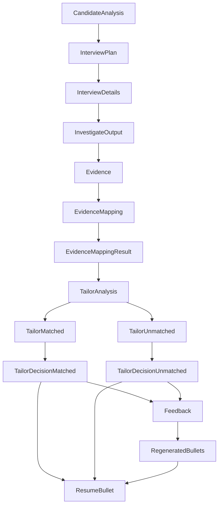

# Pydantic Model Architecture

Automatically generated from the application's Pydantic models.

## Model Pipeline



## Nested Model Structure

```mermaid
classDiagram

    class CandidateAnalysis {
        Literal['weak match', 'good match', 'strong match'] score
        Optional[str] relevant_experience?
        Optional[list[CandidateStrength]] strengths?
        Optional[list[CandidateGap]] gaps?
        str user_message
    }

    class CandidateGap {
        str requirement
        Literal['missing', 'partial', 'unclear', 'transferable'] status
        Optional[list[str]] evidence?
        str gap
    }

    class CandidateStrength {
        str requirement
        list[str] evidence
        str explanation
    }

    class Evidence {
        str project_name
        Optional[list[str]] experience_found?
        Optional[list[str]] technologies?
        Optional[list[str]] ownership?
        Optional[list[str]] scope?
        Optional[list[str]] metrics?
        Optional[list[str]] impact?
        Optional[list[str]] motivation?
        Optional[str] company?
        Optional[str] job_title?
        Optional[str] job_location?
        Optional[str] duration?
        Optional[list[str]] candidate_statements?
    }

    class EvidenceMapping {
        EvidenceWithDetails evidence_with_details
        ResumeReference resume_reference
        Literal['MATCHED', 'UNMATCHED'] mapping_status
        Optional[str] reasoning?
    }

    class EvidenceMappingResult {
        list[EvidenceMapping] evidence_mappings
    }

    class EvidenceWithDetails {
        Optional[Evidence] evidence?
        str job_requirement
        str topic_id
    }

    class Feedback {
        bool valid
        str suggestions
        str topic_id
    }

    class Feedbacks {
        list[Feedback] feedbacks
    }

    class InterviewDetails {
        str topic_id
        Literal['Low', 'Medium', 'High'] priority
        str topic
        str job_requirement
        str reason
        str objective
        list[str] relevant_experience
        Optional[list[ResumeReference]] relevant_experience_from_resume?
        str evidence_gap
    }

    class InterviewPlan {
        list[InterviewDetails] interview_plan
    }

    class InvestigateOutput {
        bool need_more_info
        str user_message
        Optional[Evidence] evidence?
    }

    class RegeneratedBullets {
        str topic_id
        list[ResumeBullet] new_bullet_points
        str reasoning
    }

    class RegeneratedBulletsList {
        list[RegeneratedBullets] regenerated_bullet_list
    }

    class ResumeBullet {
        str text
        int sentence_id
    }

    class ResumeReference {
        Literal['projects', 'work_experience', 'leadership'] type
        int entry_id
    }

    class TailorAnalysis {
        list[TailorMatched] tailor_matched_list
        list[TailorUnmatched] tailor_unmatched_list
    }

    class TailorDecisionMatched {
        Literal['KEEP', 'MODIFY', 'ADD'] action
        Optional[ResumeBullet] old_bullet?
        Optional[ResumeBullet] new_bullet?
        str reasoning
        list[str] evidence
    }

    class TailorDecisionUnmatched {
        Literal['ADD'] action
        ResumeBullet new_bullet
        str reasoning
        list[str] evidence
    }

    class TailorMatched {
        list[TailorDecisionMatched] decisions
        ResumeReference resume_reference
        str topic_id
    }

    class TailorUnmatched {
        list[TailorDecisionUnmatched] decisions
        Literal['leadership', 'work_experience', 'projects'] type
        Optional[str] company_name?
        Optional[str] duration?
        Optional[str] job_location?
        Optional[str] job_title?
        Optional[list[str]] skills?
        Optional[str] project_name?
        str topic_id
        Optional[str] leadership_position?
        Optional[str] leadership_title?
    }

    CandidateAnalysis --> CandidateGap : gaps
    CandidateAnalysis --> CandidateStrength : strengths
    EvidenceMapping --> EvidenceWithDetails : evidence_with_details
    EvidenceMapping --> ResumeReference : resume_reference
    EvidenceMappingResult "1" --> "*" EvidenceMapping : evidence_mappings
    EvidenceWithDetails --> Evidence : evidence
    Feedbacks "1" --> "*" Feedback : feedbacks
    InterviewDetails --> ResumeReference : relevant_experience_from_resume
    InterviewPlan "1" --> "*" InterviewDetails : interview_plan
    InvestigateOutput --> Evidence : evidence
    RegeneratedBullets "1" --> "*" ResumeBullet : new_bullet_points
    RegeneratedBulletsList "1" --> "*" RegeneratedBullets : regenerated_bullet_list
    TailorAnalysis "1" --> "*" TailorMatched : tailor_matched_list
    TailorAnalysis "1" --> "*" TailorUnmatched : tailor_unmatched_list
    TailorDecisionMatched --> ResumeBullet : new_bullet
    TailorDecisionMatched --> ResumeBullet : old_bullet
    TailorDecisionUnmatched --> ResumeBullet : new_bullet
    TailorMatched "1" --> "*" TailorDecisionMatched : decisions
    TailorMatched --> ResumeReference : resume_reference
    TailorUnmatched "1" --> "*" TailorDecisionUnmatched : decisions
```



## Field Reference

# Pydantic Model Field Reference

> Automatically generated from the Pydantic models.

## `CandidateAnalysis`

| Field | Type | Required | Default |
|---|---|---|---|
| `score` | `Literal['weak match', 'good match', 'strong match']` | Yes | `PydanticUndefined` |
| `relevant_experience` | `Optional[str]` | Yes | `PydanticUndefined` |
| `strengths` | `Optional[list[CandidateStrength]]` | Yes | `PydanticUndefined` |
| `gaps` | `Optional[list[CandidateGap]]` | Yes | `PydanticUndefined` |
| `user_message` | `str` | Yes | `PydanticUndefined` |

## `CandidateGap`

| Field | Type | Required | Default |
|---|---|---|---|
| `requirement` | `str` | Yes | `PydanticUndefined` |
| `status` | `Literal['missing', 'partial', 'unclear', 'transferable']` | Yes | `PydanticUndefined` |
| `evidence` | `Optional[list[str]]` | Yes | `PydanticUndefined` |
| `gap` | `str` | Yes | `PydanticUndefined` |

## `CandidateStrength`

| Field | Type | Required | Default |
|---|---|---|---|
| `requirement` | `str` | Yes | `PydanticUndefined` |
| `evidence` | `list[str]` | Yes | `PydanticUndefined` |
| `explanation` | `str` | Yes | `PydanticUndefined` |

## `Evidence`

| Field | Type | Required | Default |
|---|---|---|---|
| `project_name` | `str` | Yes | `PydanticUndefined` |
| `experience_found` | `Optional[list[str]]` | No | `None` |
| `technologies` | `Optional[list[str]]` | No | `None` |
| `ownership` | `Optional[list[str]]` | No | `None` |
| `scope` | `Optional[list[str]]` | No | `None` |
| `metrics` | `Optional[list[str]]` | No | `None` |
| `impact` | `Optional[list[str]]` | No | `None` |
| `motivation` | `Optional[list[str]]` | No | `None` |
| `company` | `Optional[str]` | No | `None` |
| `job_title` | `Optional[str]` | No | `None` |
| `job_location` | `Optional[str]` | No | `None` |
| `duration` | `Optional[str]` | No | `None` |
| `candidate_statements` | `Optional[list[str]]` | No | `None` |

**`project_name`:** Name of the project or experience. If the candidate does not provide a name, create a concise name using only established context.

**`experience_found`:** Concrete experiences, actions, responsibilities, or accomplishments discovered during the interview.

**`technologies`:** Technologies, tools, frameworks, languages, or technical methods explicitly mentioned by the candidate.

**`ownership`:** What the candidate personally owned, initiated, designed, implemented, or was responsible for.

**`scope`:** Concrete scale or context of the work, such as users, teams, systems, programs, workload, or responsibilities.

**`metrics`:** Quantitative evidence explicitly provided by the candidate. Never infer, estimate, or manufacture metrics.

**`impact`:** Concrete outcomes or changes resulting from the candidate's work, using only evidence established by the candidate.

**`motivation`:** Candidate-stated motivations, reasons, interests, or decisions that explain why they pursued or cared about the experience.

**`candidate_statements`:** Original statements from the candidate that directly support the extracted evidence. Preserve the candidate's wording without adding interpretation or unsupported details.

## `EvidenceMapping`

| Field | Type | Required | Default |
|---|---|---|---|
| `evidence_with_details` | `EvidenceWithDetails` | Yes | `PydanticUndefined` |
| `resume_reference` | `ResumeReference` | Yes | `PydanticUndefined` |
| `mapping_status` | `Literal['MATCHED', 'UNMATCHED']` | Yes | `PydanticUndefined` |
| `reasoning` | `Optional[str]` | No | `None` |

**`mapping_status`:** If bullet points are found that match evidence, return MATCH else return UNMATCHED

## `EvidenceMappingResult`

| Field | Type | Required | Default |
|---|---|---|---|
| `evidence_mappings` | `list[EvidenceMapping]` | Yes | `PydanticUndefined` |

## `EvidenceWithDetails`

| Field | Type | Required | Default |
|---|---|---|---|
| `evidence` | `Optional[Evidence]` | Yes | `PydanticUndefined` |
| `job_requirement` | `str` | Yes | `PydanticUndefined` |
| `topic_id` | `str` | Yes | `PydanticUndefined` |

**`evidence`:** Evidence found in the candidate's resume or profile data that supports their experience and qualifications for the job requirements. If no evidence is found, this field will be None

## `Feedback`

| Field | Type | Required | Default |
|---|---|---|---|
| `valid` | `bool` | Yes | `PydanticUndefined` |
| `suggestions` | `str` | Yes | `PydanticUndefined` |
| `topic_id` | `str` | Yes | `PydanticUndefined` |

**`valid`:** Whether the proposed bullet is factually supported by the candidate's evidence.

**`suggestions`:** If invalid, identify the specific claim that is unsupported or missing evidence, state that the claim must be removed or corrected, and explain which evidence limitation makes it inaccurate. If valid, state that no factual correction is required.

**`topic_id`:** The topic ID associated with the evidence used to evaluate this bullet.

## `Feedbacks`

| Field | Type | Required | Default |
|---|---|---|---|
| `feedbacks` | `list[Feedback]` | Yes | `PydanticUndefined` |

## `InterviewDetails`

| Field | Type | Required | Default |
|---|---|---|---|
| `topic_id` | `str` | Yes | `PydanticUndefined` |
| `priority` | `Literal['Low', 'Medium', 'High']` | Yes | `PydanticUndefined` |
| `topic` | `str` | Yes | `PydanticUndefined` |
| `job_requirement` | `str` | Yes | `PydanticUndefined` |
| `reason` | `str` | Yes | `PydanticUndefined` |
| `objective` | `str` | Yes | `PydanticUndefined` |
| `relevant_experience` | `list[str]` | Yes | `PydanticUndefined` |
| `relevant_experience_from_resume` | `Optional[list[ResumeReference]]` | Yes | `PydanticUndefined` |
| `evidence_gap` | `str` | Yes | `PydanticUndefined` |

**`topic_id`:** Unique identifier for topic

**`topic`:** Concise name for the specific investigation target.

**`job_requirement`:** The relevant job requirement exactly as stated or faithfully represented.

**`reason`:** Why this requirement warrants investigation for this candidate. Explain the evidence gap in candidate-specific terms rather than simply stating that the requirement is missing from the resume.

**`objective`:** What the investigation should establish. Define the specific evidence needed to determine whether this candidate can credibly demonstrate the job requirement.

**`relevant_experience`:** Candidate experiences relevant or potentially relevant to the investigation. Keep experiences distinct and do not merge experiences from different sections.

**`relevant_experience_from_resume`:** References to complete resume entries relevant to this topic. Each reference identifies an entry by type and entry_id. Return None if no relevant resume entries exist.

**`evidence_gap`:** The specific important fact, evidence, or uncertainty that is currently unknown, weak, or insufficiently demonstrated. This should describe what the interview needs to uncover, not merely repeat the job requirement.

## `InterviewPlan`

| Field | Type | Required | Default |
|---|---|---|---|
| `interview_plan` | `list[InterviewDetails]` | Yes | `PydanticUndefined` |

## `InvestigateOutput`

| Field | Type | Required | Default |
|---|---|---|---|
| `need_more_info` | `bool` | Yes | `PydanticUndefined` |
| `user_message` | `str` | Yes | `PydanticUndefined` |
| `evidence` | `Optional[Evidence]` | Yes | `PydanticUndefined` |

**`need_more_info`:** If more context is needed to investigate candidate experience, return True, else False

**`user_message`:** Message to the user asking for more details/clarification or letting them know they've provided enough context

## `RegeneratedBullets`

| Field | Type | Required | Default |
|---|---|---|---|
| `topic_id` | `str` | Yes | `PydanticUndefined` |
| `new_bullet_points` | `list[ResumeBullet]` | Yes | `PydanticUndefined` |
| `reasoning` | `str` | Yes | `PydanticUndefined` |

**`new_bullet_points`:** New bulletpoint points, utilizing XYZ format, accomplished X, as measured by Y, by doing Z, if enough details is present such as metrics/impact. Ensure bullet points created are aligned with job requirement. Do not invent metrics or details if not present

## `RegeneratedBulletsList`

| Field | Type | Required | Default |
|---|---|---|---|
| `regenerated_bullet_list` | `list[RegeneratedBullets]` | Yes | `PydanticUndefined` |

## `ResumeBullet`

| Field | Type | Required | Default |
|---|---|---|---|
| `text` | `str` | Yes | `PydanticUndefined` |
| `sentence_id` | `int` | Yes | `PydanticUndefined` |

## `ResumeReference`

| Field | Type | Required | Default |
|---|---|---|---|
| `type` | `Literal['projects', 'work_experience', 'leadership']` | Yes | `PydanticUndefined` |
| `entry_id` | `int` | Yes | `PydanticUndefined` |

**`entry_id`:** The entry_id of the resume entry being referenced.

## `TailorAnalysis`

| Field | Type | Required | Default |
|---|---|---|---|
| `tailor_matched_list` | `list[TailorMatched]` | No | `[]` |
| `tailor_unmatched_list` | `list[TailorUnmatched]` | No | `[]` |

## `TailorDecisionMatched`

| Field | Type | Required | Default |
|---|---|---|---|
| `action` | `Literal['KEEP', 'MODIFY', 'ADD']` | Yes | `PydanticUndefined` |
| `old_bullet` | `Optional[ResumeBullet]` | Yes | `PydanticUndefined` |
| `new_bullet` | `Optional[ResumeBullet]` | Yes | `PydanticUndefined` |
| `reasoning` | `str` | Yes | `PydanticUndefined` |
| `evidence` | `list[str]` | Yes | `PydanticUndefined` |

**`new_bullet`:** New bulletpoint points, utilizing XYZ format, accomplished X, as measured by Y, by doing Z, if enough details is present such as metrics/impact. Ensure bullet points created are aligned with job requirement. Do not invent metrics or details if not present

## `TailorDecisionUnmatched`

| Field | Type | Required | Default |
|---|---|---|---|
| `action` | `Literal['ADD']` | Yes | `PydanticUndefined` |
| `new_bullet` | `ResumeBullet` | Yes | `PydanticUndefined` |
| `reasoning` | `str` | Yes | `PydanticUndefined` |
| `evidence` | `list[str]` | Yes | `PydanticUndefined` |

**`new_bullet`:** New bulletpoint points, utilizing XYZ format, accomplished X, as measured by Y, by doing Z, if enough details is present such as metrics/impact. Ensure bullet points created are aligned with job requirement. Do not invent metrics or details if not present

## `TailorMatched`

| Field | Type | Required | Default |
|---|---|---|---|
| `decisions` | `list[TailorDecisionMatched]` | Yes | `PydanticUndefined` |
| `resume_reference` | `ResumeReference` | Yes | `PydanticUndefined` |
| `topic_id` | `str` | Yes | `PydanticUndefined` |

**`resume_reference`:** Copy the resume_reference from the input exactly. This is an immutable identifier. Never modify or generate it.

**`topic_id`:** Copy the topic_id from the input exactly. Do not modify or generate new one

## `TailorUnmatched`

| Field | Type | Required | Default |
|---|---|---|---|
| `decisions` | `list[TailorDecisionUnmatched]` | Yes | `PydanticUndefined` |
| `type` | `Literal['leadership', 'work_experience', 'projects']` | Yes | `PydanticUndefined` |
| `company_name` | `Optional[str]` | No | `Company name if experience learned from work. Otherwise return None` |
| `duration` | `Optional[str]` | No | `Duration of work experience if provided. Example: Dec 2024 - Present` |
| `job_location` | `Optional[str]` | Yes | `PydanticUndefined` |
| `job_title` | `Optional[str]` | No | `Job title at company if experienced learned from work. Otherwise return None` |
| `skills` | `Optional[list[str]]` | No | `List of technologies or skills that was used from the experience` |
| `project_name` | `Optional[str]` | No | `Project name where experience was learned. Return None if experience was learned from work` |
| `topic_id` | `str` | Yes | `PydanticUndefined` |
| `leadership_position` | `Optional[str]` | Yes | `PydanticUndefined` |
| `leadership_title` | `Optional[str]` | Yes | `PydanticUndefined` |

**`topic_id`:** Copy the topic_id from the input exactly. Do not modify or generate new one


## Raw JSON Schema

```json
{
  "CandidateAnalysis": {
    "$defs": {
      "CandidateGap": {
        "properties": {
          "requirement": {
            "title": "Requirement",
            "type": "string"
          },
          "status": {
            "enum": [
              "missing",
              "partial",
              "unclear",
              "transferable"
            ],
            "title": "Status",
            "type": "string"
          },
          "evidence": {
            "anyOf": [
              {
                "items": {
                  "type": "string"
                },
                "type": "array"
              },
              {
                "type": "null"
              }
            ],
            "title": "Evidence"
          },
          "gap": {
            "title": "Gap",
            "type": "string"
          }
        },
        "required": [
          "requirement",
          "status",
          "evidence",
          "gap"
        ],
        "title": "CandidateGap",
        "type": "object"
      },
      "CandidateStrength": {
        "properties": {
          "requirement": {
            "title": "Requirement",
            "type": "string"
          },
          "evidence": {
            "items": {
              "type": "string"
            },
            "title": "Evidence",
            "type": "array"
          },
          "explanation": {
            "title": "Explanation",
            "type": "string"
          }
        },
        "required": [
          "requirement",
          "evidence",
          "explanation"
        ],
        "title": "CandidateStrength",
        "type": "object"
      }
    },
    "properties": {
      "score": {
        "enum": [
          "weak match",
          "good match",
          "strong match"
        ],
        "title": "Score",
        "type": "string"
      },
      "relevant_experience": {
        "anyOf": [
          {
            "type": "string"
          },
          {
            "type": "null"
          }
        ],
        "title": "Relevant Experience"
      },
      "strengths": {
        "anyOf": [
          {
            "items": {
              "$ref": "#/$defs/CandidateStrength"
            },
            "type": "array"
          },
          {
            "type": "null"
          }
        ],
        "title": "Strengths"
      },
      "gaps": {
        "anyOf": [
          {
            "items": {
              "$ref": "#/$defs/CandidateGap"
            },
            "type": "array"
          },
          {
            "type": "null"
          }
        ],
        "title": "Gaps"
      },
      "user_message": {
        "title": "User Message",
        "type": "string"
      }
    },
    "required": [
      "score",
      "relevant_experience",
      "strengths",
      "gaps",
      "user_message"
    ],
    "title": "CandidateAnalysis",
    "type": "object"
  },
  "CandidateGap": {
    "properties": {
      "requirement": {
        "title": "Requirement",
        "type": "string"
      },
      "status": {
        "enum": [
          "missing",
          "partial",
          "unclear",
          "transferable"
        ],
        "title": "Status",
        "type": "string"
      },
      "evidence": {
        "anyOf": [
          {
            "items": {
              "type": "string"
            },
            "type": "array"
          },
          {
            "type": "null"
          }
        ],
        "title": "Evidence"
      },
      "gap": {
        "title": "Gap",
        "type": "string"
      }
    },
    "required": [
      "requirement",
      "status",
      "evidence",
      "gap"
    ],
    "title": "CandidateGap",
    "type": "object"
  },
  "CandidateStrength": {
    "properties": {
      "requirement": {
        "title": "Requirement",
        "type": "string"
      },
      "evidence": {
        "items": {
          "type": "string"
        },
        "title": "Evidence",
        "type": "array"
      },
      "explanation": {
        "title": "Explanation",
        "type": "string"
      }
    },
    "required": [
      "requirement",
      "evidence",
      "explanation"
    ],
    "title": "CandidateStrength",
    "type": "object"
  },
  "Evidence": {
    "properties": {
      "project_name": {
        "description": "Name of the project or experience. If the candidate does not provide a name, create a concise name using only established context.",
        "title": "Project Name",
        "type": "string"
      },
      "experience_found": {
        "anyOf": [
          {
            "items": {
              "type": "string"
            },
            "type": "array"
          },
          {
            "type": "null"
          }
        ],
        "default": null,
        "description": "Concrete experiences, actions, responsibilities, or accomplishments discovered during the interview.",
        "title": "Experience Found"
      },
      "technologies": {
        "anyOf": [
          {
            "items": {
              "type": "string"
            },
            "type": "array"
          },
          {
            "type": "null"
          }
        ],
        "default": null,
        "description": "Technologies, tools, frameworks, languages, or technical methods explicitly mentioned by the candidate.",
        "title": "Technologies"
      },
      "ownership": {
        "anyOf": [
          {
            "items": {
              "type": "string"
            },
            "type": "array"
          },
          {
            "type": "null"
          }
        ],
        "default": null,
        "description": "What the candidate personally owned, initiated, designed, implemented, or was responsible for.",
        "title": "Ownership"
      },
      "scope": {
        "anyOf": [
          {
            "items": {
              "type": "string"
            },
            "type": "array"
          },
          {
            "type": "null"
          }
        ],
        "default": null,
        "description": "Concrete scale or context of the work, such as users, teams, systems, programs, workload, or responsibilities.",
        "title": "Scope"
      },
      "metrics": {
        "anyOf": [
          {
            "items": {
              "type": "string"
            },
            "type": "array"
          },
          {
            "type": "null"
          }
        ],
        "default": null,
        "description": "Quantitative evidence explicitly provided by the candidate. Never infer, estimate, or manufacture metrics.",
        "title": "Metrics"
      },
      "impact": {
        "anyOf": [
          {
            "items": {
              "type": "string"
            },
            "type": "array"
          },
          {
            "type": "null"
          }
        ],
        "default": null,
        "description": "Concrete outcomes or changes resulting from the candidate's work, using only evidence established by the candidate.",
        "title": "Impact"
      },
      "motivation": {
        "anyOf": [
          {
            "items": {
              "type": "string"
            },
            "type": "array"
          },
          {
            "type": "null"
          }
        ],
        "default": null,
        "description": "Candidate-stated motivations, reasons, interests, or decisions that explain why they pursued or cared about the experience.",
        "title": "Motivation"
      },
      "company": {
        "anyOf": [
          {
            "type": "string"
          },
          {
            "type": "null"
          }
        ],
        "default": null,
        "title": "Company"
      },
      "job_title": {
        "anyOf": [
          {
            "type": "string"
          },
          {
            "type": "null"
          }
        ],
        "default": null,
        "title": "Job Title"
      },
      "job_location": {
        "anyOf": [
          {
            "type": "string"
          },
          {
            "type": "null"
          }
        ],
        "default": null,
        "title": "Job Location"
      },
      "duration": {
        "anyOf": [
          {
            "type": "string"
          },
          {
            "type": "null"
          }
        ],
        "default": null,
        "title": "Duration"
      },
      "candidate_statements": {
        "anyOf": [
          {
            "items": {
              "type": "string"
            },
            "type": "array"
          },
          {
            "type": "null"
          }
        ],
        "default": null,
        "description": "Original statements from the candidate that directly support the extracted evidence. Preserve the candidate's wording without adding interpretation or unsupported details.",
        "title": "Candidate Statements"
      }
    },
    "required": [
      "project_name"
    ],
    "title": "Evidence",
    "type": "object"
  },
  "EvidenceMapping": {
    "$defs": {
      "Evidence": {
        "properties": {
          "project_name": {
            "description": "Name of the project or experience. If the candidate does not provide a name, create a concise name using only established context.",
            "title": "Project Name",
            "type": "string"
          },
          "experience_found": {
            "anyOf": [
              {
                "items": {
                  "type": "string"
                },
                "type": "array"
              },
              {
                "type": "null"
              }
            ],
            "default": null,
            "description": "Concrete experiences, actions, responsibilities, or accomplishments discovered during the interview.",
            "title": "Experience Found"
          },
          "technologies": {
            "anyOf": [
              {
                "items": {
                  "type": "string"
                },
                "type": "array"
              },
              {
                "type": "null"
              }
            ],
            "default": null,
            "description": "Technologies, tools, frameworks, languages, or technical methods explicitly mentioned by the candidate.",
            "title": "Technologies"
          },
          "ownership": {
            "anyOf": [
              {
                "items": {
                  "type": "string"
                },
                "type": "array"
              },
              {
                "type": "null"
              }
            ],
            "default": null,
            "description": "What the candidate personally owned, initiated, designed, implemented, or was responsible for.",
            "title": "Ownership"
          },
          "scope": {
            "anyOf": [
              {
                "items": {
                  "type": "string"
                },
                "type": "array"
              },
              {
                "type": "null"
              }
            ],
            "default": null,
            "description": "Concrete scale or context of the work, such as users, teams, systems, programs, workload, or responsibilities.",
            "title": "Scope"
          },
          "metrics": {
            "anyOf": [
              {
                "items": {
                  "type": "string"
                },
                "type": "array"
              },
              {
                "type": "null"
              }
            ],
            "default": null,
            "description": "Quantitative evidence explicitly provided by the candidate. Never infer, estimate, or manufacture metrics.",
            "title": "Metrics"
          },
          "impact": {
            "anyOf": [
              {
                "items": {
                  "type": "string"
                },
                "type": "array"
              },
              {
                "type": "null"
              }
            ],
            "default": null,
            "description": "Concrete outcomes or changes resulting from the candidate's work, using only evidence established by the candidate.",
            "title": "Impact"
          },
          "motivation": {
            "anyOf": [
              {
                "items": {
                  "type": "string"
                },
                "type": "array"
              },
              {
                "type": "null"
              }
            ],
            "default": null,
            "description": "Candidate-stated motivations, reasons, interests, or decisions that explain why they pursued or cared about the experience.",
            "title": "Motivation"
          },
          "company": {
            "anyOf": [
              {
                "type": "string"
              },
              {
                "type": "null"
              }
            ],
            "default": null,
            "title": "Company"
          },
          "job_title": {
            "anyOf": [
              {
                "type": "string"
              },
              {
                "type": "null"
              }
            ],
            "default": null,
            "title": "Job Title"
          },
          "job_location": {
            "anyOf": [
              {
                "type": "string"
              },
              {
                "type": "null"
              }
            ],
            "default": null,
            "title": "Job Location"
          },
          "duration": {
            "anyOf": [
              {
                "type": "string"
              },
              {
                "type": "null"
              }
            ],
            "default": null,
            "title": "Duration"
          },
          "candidate_statements": {
            "anyOf": [
              {
                "items": {
                  "type": "string"
                },
                "type": "array"
              },
              {
                "type": "null"
              }
            ],
            "default": null,
            "description": "Original statements from the candidate that directly support the extracted evidence. Preserve the candidate's wording without adding interpretation or unsupported details.",
            "title": "Candidate Statements"
          }
        },
        "required": [
          "project_name"
        ],
        "title": "Evidence",
        "type": "object"
      },
      "EvidenceWithDetails": {
        "properties": {
          "evidence": {
            "anyOf": [
              {
                "$ref": "#/$defs/Evidence"
              },
              {
                "type": "null"
              }
            ],
            "description": "Evidence found in the candidate's resume or profile data that supports their experience and qualifications for the job requirements. If no evidence is found, this field will be None"
          },
          "job_requirement": {
            "title": "Job Requirement",
            "type": "string"
          },
          "topic_id": {
            "title": "Topic Id",
            "type": "string"
          }
        },
        "required": [
          "evidence",
          "job_requirement",
          "topic_id"
        ],
        "title": "EvidenceWithDetails",
        "type": "object"
      },
      "ResumeReference": {
        "properties": {
          "type": {
            "enum": [
              "projects",
              "work_experience",
              "leadership"
            ],
            "title": "Type",
            "type": "string"
          },
          "entry_id": {
            "description": "The entry_id of the resume entry being referenced.",
            "title": "Entry Id",
            "type": "integer"
          }
        },
        "required": [
          "type",
          "entry_id"
        ],
        "title": "ResumeReference",
        "type": "object"
      }
    },
    "properties": {
      "evidence_with_details": {
        "$ref": "#/$defs/EvidenceWithDetails"
      },
      "resume_reference": {
        "$ref": "#/$defs/ResumeReference"
      },
      "mapping_status": {
        "description": "If bullet points are found that match evidence, return MATCH else return UNMATCHED",
        "enum": [
          "MATCHED",
          "UNMATCHED"
        ],
        "title": "Mapping Status",
        "type": "string"
      },
      "reasoning": {
        "anyOf": [
          {
            "type": "string"
          },
          {
            "type": "null"
          }
        ],
        "default": null,
        "title": "Reasoning"
      }
    },
    "required": [
      "evidence_with_details",
      "resume_reference",
      "mapping_status"
    ],
    "title": "EvidenceMapping",
    "type": "object"
  },
  "EvidenceMappingResult": {
    "$defs": {
      "Evidence": {
        "properties": {
          "project_name": {
            "description": "Name of the project or experience. If the candidate does not provide a name, create a concise name using only established context.",
            "title": "Project Name",
            "type": "string"
          },
          "experience_found": {
            "anyOf": [
              {
                "items": {
                  "type": "string"
                },
                "type": "array"
              },
              {
                "type": "null"
              }
            ],
            "default": null,
            "description": "Concrete experiences, actions, responsibilities, or accomplishments discovered during the interview.",
            "title": "Experience Found"
          },
          "technologies": {
            "anyOf": [
              {
                "items": {
                  "type": "string"
                },
                "type": "array"
              },
              {
                "type": "null"
              }
            ],
            "default": null,
            "description": "Technologies, tools, frameworks, languages, or technical methods explicitly mentioned by the candidate.",
            "title": "Technologies"
          },
          "ownership": {
            "anyOf": [
              {
                "items": {
                  "type": "string"
                },
                "type": "array"
              },
              {
                "type": "null"
              }
            ],
            "default": null,
            "description": "What the candidate personally owned, initiated, designed, implemented, or was responsible for.",
            "title": "Ownership"
          },
          "scope": {
            "anyOf": [
              {
                "items": {
                  "type": "string"
                },
                "type": "array"
              },
              {
                "type": "null"
              }
            ],
            "default": null,
            "description": "Concrete scale or context of the work, such as users, teams, systems, programs, workload, or responsibilities.",
            "title": "Scope"
          },
          "metrics": {
            "anyOf": [
              {
                "items": {
                  "type": "string"
                },
                "type": "array"
              },
              {
                "type": "null"
              }
            ],
            "default": null,
            "description": "Quantitative evidence explicitly provided by the candidate. Never infer, estimate, or manufacture metrics.",
            "title": "Metrics"
          },
          "impact": {
            "anyOf": [
              {
                "items": {
                  "type": "string"
                },
                "type": "array"
              },
              {
                "type": "null"
              }
            ],
            "default": null,
            "description": "Concrete outcomes or changes resulting from the candidate's work, using only evidence established by the candidate.",
            "title": "Impact"
          },
          "motivation": {
            "anyOf": [
              {
                "items": {
                  "type": "string"
                },
                "type": "array"
              },
              {
                "type": "null"
              }
            ],
            "default": null,
            "description": "Candidate-stated motivations, reasons, interests, or decisions that explain why they pursued or cared about the experience.",
            "title": "Motivation"
          },
          "company": {
            "anyOf": [
              {
                "type": "string"
              },
              {
                "type": "null"
              }
            ],
            "default": null,
            "title": "Company"
          },
          "job_title": {
            "anyOf": [
              {
                "type": "string"
              },
              {
                "type": "null"
              }
            ],
            "default": null,
            "title": "Job Title"
          },
          "job_location": {
            "anyOf": [
              {
                "type": "string"
              },
              {
                "type": "null"
              }
            ],
            "default": null,
            "title": "Job Location"
          },
          "duration": {
            "anyOf": [
              {
                "type": "string"
              },
              {
                "type": "null"
              }
            ],
            "default": null,
            "title": "Duration"
          },
          "candidate_statements": {
            "anyOf": [
              {
                "items": {
                  "type": "string"
                },
                "type": "array"
              },
              {
                "type": "null"
              }
            ],
            "default": null,
            "description": "Original statements from the candidate that directly support the extracted evidence. Preserve the candidate's wording without adding interpretation or unsupported details.",
            "title": "Candidate Statements"
          }
        },
        "required": [
          "project_name"
        ],
        "title": "Evidence",
        "type": "object"
      },
      "EvidenceMapping": {
        "properties": {
          "evidence_with_details": {
            "$ref": "#/$defs/EvidenceWithDetails"
          },
          "resume_reference": {
            "$ref": "#/$defs/ResumeReference"
          },
          "mapping_status": {
            "description": "If bullet points are found that match evidence, return MATCH else return UNMATCHED",
            "enum": [
              "MATCHED",
              "UNMATCHED"
            ],
            "title": "Mapping Status",
            "type": "string"
          },
          "reasoning": {
            "anyOf": [
              {
                "type": "string"
              },
              {
                "type": "null"
              }
            ],
            "default": null,
            "title": "Reasoning"
          }
        },
        "required": [
          "evidence_with_details",
          "resume_reference",
          "mapping_status"
        ],
        "title": "EvidenceMapping",
        "type": "object"
      },
      "EvidenceWithDetails": {
        "properties": {
          "evidence": {
            "anyOf": [
              {
                "$ref": "#/$defs/Evidence"
              },
              {
                "type": "null"
              }
            ],
            "description": "Evidence found in the candidate's resume or profile data that supports their experience and qualifications for the job requirements. If no evidence is found, this field will be None"
          },
          "job_requirement": {
            "title": "Job Requirement",
            "type": "string"
          },
          "topic_id": {
            "title": "Topic Id",
            "type": "string"
          }
        },
        "required": [
          "evidence",
          "job_requirement",
          "topic_id"
        ],
        "title": "EvidenceWithDetails",
        "type": "object"
      },
      "ResumeReference": {
        "properties": {
          "type": {
            "enum": [
              "projects",
              "work_experience",
              "leadership"
            ],
            "title": "Type",
            "type": "string"
          },
          "entry_id": {
            "description": "The entry_id of the resume entry being referenced.",
            "title": "Entry Id",
            "type": "integer"
          }
        },
        "required": [
          "type",
          "entry_id"
        ],
        "title": "ResumeReference",
        "type": "object"
      }
    },
    "properties": {
      "evidence_mappings": {
        "items": {
          "$ref": "#/$defs/EvidenceMapping"
        },
        "title": "Evidence Mappings",
        "type": "array"
      }
    },
    "required": [
      "evidence_mappings"
    ],
    "title": "EvidenceMappingResult",
    "type": "object"
  },
  "EvidenceWithDetails": {
    "$defs": {
      "Evidence": {
        "properties": {
          "project_name": {
            "description": "Name of the project or experience. If the candidate does not provide a name, create a concise name using only established context.",
            "title": "Project Name",
            "type": "string"
          },
          "experience_found": {
            "anyOf": [
              {
                "items": {
                  "type": "string"
                },
                "type": "array"
              },
              {
                "type": "null"
              }
            ],
            "default": null,
            "description": "Concrete experiences, actions, responsibilities, or accomplishments discovered during the interview.",
            "title": "Experience Found"
          },
          "technologies": {
            "anyOf": [
              {
                "items": {
                  "type": "string"
                },
                "type": "array"
              },
              {
                "type": "null"
              }
            ],
            "default": null,
            "description": "Technologies, tools, frameworks, languages, or technical methods explicitly mentioned by the candidate.",
            "title": "Technologies"
          },
          "ownership": {
            "anyOf": [
              {
                "items": {
                  "type": "string"
                },
                "type": "array"
              },
              {
                "type": "null"
              }
            ],
            "default": null,
            "description": "What the candidate personally owned, initiated, designed, implemented, or was responsible for.",
            "title": "Ownership"
          },
          "scope": {
            "anyOf": [
              {
                "items": {
                  "type": "string"
                },
                "type": "array"
              },
              {
                "type": "null"
              }
            ],
            "default": null,
            "description": "Concrete scale or context of the work, such as users, teams, systems, programs, workload, or responsibilities.",
            "title": "Scope"
          },
          "metrics": {
            "anyOf": [
              {
                "items": {
                  "type": "string"
                },
                "type": "array"
              },
              {
                "type": "null"
              }
            ],
            "default": null,
            "description": "Quantitative evidence explicitly provided by the candidate. Never infer, estimate, or manufacture metrics.",
            "title": "Metrics"
          },
          "impact": {
            "anyOf": [
              {
                "items": {
                  "type": "string"
                },
                "type": "array"
              },
              {
                "type": "null"
              }
            ],
            "default": null,
            "description": "Concrete outcomes or changes resulting from the candidate's work, using only evidence established by the candidate.",
            "title": "Impact"
          },
          "motivation": {
            "anyOf": [
              {
                "items": {
                  "type": "string"
                },
                "type": "array"
              },
              {
                "type": "null"
              }
            ],
            "default": null,
            "description": "Candidate-stated motivations, reasons, interests, or decisions that explain why they pursued or cared about the experience.",
            "title": "Motivation"
          },
          "company": {
            "anyOf": [
              {
                "type": "string"
              },
              {
                "type": "null"
              }
            ],
            "default": null,
            "title": "Company"
          },
          "job_title": {
            "anyOf": [
              {
                "type": "string"
              },
              {
                "type": "null"
              }
            ],
            "default": null,
            "title": "Job Title"
          },
          "job_location": {
            "anyOf": [
              {
                "type": "string"
              },
              {
                "type": "null"
              }
            ],
            "default": null,
            "title": "Job Location"
          },
          "duration": {
            "anyOf": [
              {
                "type": "string"
              },
              {
                "type": "null"
              }
            ],
            "default": null,
            "title": "Duration"
          },
          "candidate_statements": {
            "anyOf": [
              {
                "items": {
                  "type": "string"
                },
                "type": "array"
              },
              {
                "type": "null"
              }
            ],
            "default": null,
            "description": "Original statements from the candidate that directly support the extracted evidence. Preserve the candidate's wording without adding interpretation or unsupported details.",
            "title": "Candidate Statements"
          }
        },
        "required": [
          "project_name"
        ],
        "title": "Evidence",
        "type": "object"
      }
    },
    "properties": {
      "evidence": {
        "anyOf": [
          {
            "$ref": "#/$defs/Evidence"
          },
          {
            "type": "null"
          }
        ],
        "description": "Evidence found in the candidate's resume or profile data that supports their experience and qualifications for the job requirements. If no evidence is found, this field will be None"
      },
      "job_requirement": {
        "title": "Job Requirement",
        "type": "string"
      },
      "topic_id": {
        "title": "Topic Id",
        "type": "string"
      }
    },
    "required": [
      "evidence",
      "job_requirement",
      "topic_id"
    ],
    "title": "EvidenceWithDetails",
    "type": "object"
  },
  "Feedback": {
    "properties": {
      "valid": {
        "description": "Whether the proposed bullet is factually supported by the candidate's evidence.",
        "title": "Valid",
        "type": "boolean"
      },
      "suggestions": {
        "description": "If invalid, identify the specific claim that is unsupported or missing evidence, state that the claim must be removed or corrected, and explain which evidence limitation makes it inaccurate. If valid, state that no factual correction is required.",
        "title": "Suggestions",
        "type": "string"
      },
      "topic_id": {
        "description": "The topic ID associated with the evidence used to evaluate this bullet.",
        "title": "Topic Id",
        "type": "string"
      }
    },
    "required": [
      "valid",
      "suggestions",
      "topic_id"
    ],
    "title": "Feedback",
    "type": "object"
  },
  "Feedbacks": {
    "$defs": {
      "Feedback": {
        "properties": {
          "valid": {
            "description": "Whether the proposed bullet is factually supported by the candidate's evidence.",
            "title": "Valid",
            "type": "boolean"
          },
          "suggestions": {
            "description": "If invalid, identify the specific claim that is unsupported or missing evidence, state that the claim must be removed or corrected, and explain which evidence limitation makes it inaccurate. If valid, state that no factual correction is required.",
            "title": "Suggestions",
            "type": "string"
          },
          "topic_id": {
            "description": "The topic ID associated with the evidence used to evaluate this bullet.",
            "title": "Topic Id",
            "type": "string"
          }
        },
        "required": [
          "valid",
          "suggestions",
          "topic_id"
        ],
        "title": "Feedback",
        "type": "object"
      }
    },
    "properties": {
      "feedbacks": {
        "items": {
          "$ref": "#/$defs/Feedback"
        },
        "title": "Feedbacks",
        "type": "array"
      }
    },
    "required": [
      "feedbacks"
    ],
    "title": "Feedbacks",
    "type": "object"
  },
  "InterviewDetails": {
    "$defs": {
      "ResumeReference": {
        "properties": {
          "type": {
            "enum": [
              "projects",
              "work_experience",
              "leadership"
            ],
            "title": "Type",
            "type": "string"
          },
          "entry_id": {
            "description": "The entry_id of the resume entry being referenced.",
            "title": "Entry Id",
            "type": "integer"
          }
        },
        "required": [
          "type",
          "entry_id"
        ],
        "title": "ResumeReference",
        "type": "object"
      }
    },
    "properties": {
      "topic_id": {
        "description": "Unique identifier for topic",
        "title": "Topic Id",
        "type": "string"
      },
      "priority": {
        "enum": [
          "Low",
          "Medium",
          "High"
        ],
        "title": "Priority",
        "type": "string"
      },
      "topic": {
        "description": "Concise name for the specific investigation target.",
        "title": "Topic",
        "type": "string"
      },
      "job_requirement": {
        "description": "The relevant job requirement exactly as stated or faithfully represented.",
        "title": "Job Requirement",
        "type": "string"
      },
      "reason": {
        "description": "Why this requirement warrants investigation for this candidate. Explain the evidence gap in candidate-specific terms rather than simply stating that the requirement is missing from the resume.",
        "title": "Reason",
        "type": "string"
      },
      "objective": {
        "description": "What the investigation should establish. Define the specific evidence needed to determine whether this candidate can credibly demonstrate the job requirement.",
        "title": "Objective",
        "type": "string"
      },
      "relevant_experience": {
        "description": "Candidate experiences relevant or potentially relevant to the investigation. Keep experiences distinct and do not merge experiences from different sections.",
        "items": {
          "type": "string"
        },
        "title": "Relevant Experience",
        "type": "array"
      },
      "relevant_experience_from_resume": {
        "anyOf": [
          {
            "items": {
              "$ref": "#/$defs/ResumeReference"
            },
            "type": "array"
          },
          {
            "type": "null"
          }
        ],
        "description": "References to complete resume entries relevant to this topic. Each reference identifies an entry by type and entry_id. Return None if no relevant resume entries exist.",
        "title": "Relevant Experience From Resume"
      },
      "evidence_gap": {
        "description": "The specific important fact, evidence, or uncertainty that is currently unknown, weak, or insufficiently demonstrated. This should describe what the interview needs to uncover, not merely repeat the job requirement.",
        "title": "Evidence Gap",
        "type": "string"
      }
    },
    "required": [
      "topic_id",
      "priority",
      "topic",
      "job_requirement",
      "reason",
      "objective",
      "relevant_experience",
      "relevant_experience_from_resume",
      "evidence_gap"
    ],
    "title": "InterviewDetails",
    "type": "object"
  },
  "InterviewPlan": {
    "$defs": {
      "InterviewDetails": {
        "properties": {
          "topic_id": {
            "description": "Unique identifier for topic",
            "title": "Topic Id",
            "type": "string"
          },
          "priority": {
            "enum": [
              "Low",
              "Medium",
              "High"
            ],
            "title": "Priority",
            "type": "string"
          },
          "topic": {
            "description": "Concise name for the specific investigation target.",
            "title": "Topic",
            "type": "string"
          },
          "job_requirement": {
            "description": "The relevant job requirement exactly as stated or faithfully represented.",
            "title": "Job Requirement",
            "type": "string"
          },
          "reason": {
            "description": "Why this requirement warrants investigation for this candidate. Explain the evidence gap in candidate-specific terms rather than simply stating that the requirement is missing from the resume.",
            "title": "Reason",
            "type": "string"
          },
          "objective": {
            "description": "What the investigation should establish. Define the specific evidence needed to determine whether this candidate can credibly demonstrate the job requirement.",
            "title": "Objective",
            "type": "string"
          },
          "relevant_experience": {
            "description": "Candidate experiences relevant or potentially relevant to the investigation. Keep experiences distinct and do not merge experiences from different sections.",
            "items": {
              "type": "string"
            },
            "title": "Relevant Experience",
            "type": "array"
          },
          "relevant_experience_from_resume": {
            "anyOf": [
              {
                "items": {
                  "$ref": "#/$defs/ResumeReference"
                },
                "type": "array"
              },
              {
                "type": "null"
              }
            ],
            "description": "References to complete resume entries relevant to this topic. Each reference identifies an entry by type and entry_id. Return None if no relevant resume entries exist.",
            "title": "Relevant Experience From Resume"
          },
          "evidence_gap": {
            "description": "The specific important fact, evidence, or uncertainty that is currently unknown, weak, or insufficiently demonstrated. This should describe what the interview needs to uncover, not merely repeat the job requirement.",
            "title": "Evidence Gap",
            "type": "string"
          }
        },
        "required": [
          "topic_id",
          "priority",
          "topic",
          "job_requirement",
          "reason",
          "objective",
          "relevant_experience",
          "relevant_experience_from_resume",
          "evidence_gap"
        ],
        "title": "InterviewDetails",
        "type": "object"
      },
      "ResumeReference": {
        "properties": {
          "type": {
            "enum": [
              "projects",
              "work_experience",
              "leadership"
            ],
            "title": "Type",
            "type": "string"
          },
          "entry_id": {
            "description": "The entry_id of the resume entry being referenced.",
            "title": "Entry Id",
            "type": "integer"
          }
        },
        "required": [
          "type",
          "entry_id"
        ],
        "title": "ResumeReference",
        "type": "object"
      }
    },
    "properties": {
      "interview_plan": {
        "items": {
          "$ref": "#/$defs/InterviewDetails"
        },
        "title": "Interview Plan",
        "type": "array"
      }
    },
    "required": [
      "interview_plan"
    ],
    "title": "InterviewPlan",
    "type": "object"
  },
  "InvestigateOutput": {
    "$defs": {
      "Evidence": {
        "properties": {
          "project_name": {
            "description": "Name of the project or experience. If the candidate does not provide a name, create a concise name using only established context.",
            "title": "Project Name",
            "type": "string"
          },
          "experience_found": {
            "anyOf": [
              {
                "items": {
                  "type": "string"
                },
                "type": "array"
              },
              {
                "type": "null"
              }
            ],
            "default": null,
            "description": "Concrete experiences, actions, responsibilities, or accomplishments discovered during the interview.",
            "title": "Experience Found"
          },
          "technologies": {
            "anyOf": [
              {
                "items": {
                  "type": "string"
                },
                "type": "array"
              },
              {
                "type": "null"
              }
            ],
            "default": null,
            "description": "Technologies, tools, frameworks, languages, or technical methods explicitly mentioned by the candidate.",
            "title": "Technologies"
          },
          "ownership": {
            "anyOf": [
              {
                "items": {
                  "type": "string"
                },
                "type": "array"
              },
              {
                "type": "null"
              }
            ],
            "default": null,
            "description": "What the candidate personally owned, initiated, designed, implemented, or was responsible for.",
            "title": "Ownership"
          },
          "scope": {
            "anyOf": [
              {
                "items": {
                  "type": "string"
                },
                "type": "array"
              },
              {
                "type": "null"
              }
            ],
            "default": null,
            "description": "Concrete scale or context of the work, such as users, teams, systems, programs, workload, or responsibilities.",
            "title": "Scope"
          },
          "metrics": {
            "anyOf": [
              {
                "items": {
                  "type": "string"
                },
                "type": "array"
              },
              {
                "type": "null"
              }
            ],
            "default": null,
            "description": "Quantitative evidence explicitly provided by the candidate. Never infer, estimate, or manufacture metrics.",
            "title": "Metrics"
          },
          "impact": {
            "anyOf": [
              {
                "items": {
                  "type": "string"
                },
                "type": "array"
              },
              {
                "type": "null"
              }
            ],
            "default": null,
            "description": "Concrete outcomes or changes resulting from the candidate's work, using only evidence established by the candidate.",
            "title": "Impact"
          },
          "motivation": {
            "anyOf": [
              {
                "items": {
                  "type": "string"
                },
                "type": "array"
              },
              {
                "type": "null"
              }
            ],
            "default": null,
            "description": "Candidate-stated motivations, reasons, interests, or decisions that explain why they pursued or cared about the experience.",
            "title": "Motivation"
          },
          "company": {
            "anyOf": [
              {
                "type": "string"
              },
              {
                "type": "null"
              }
            ],
            "default": null,
            "title": "Company"
          },
          "job_title": {
            "anyOf": [
              {
                "type": "string"
              },
              {
                "type": "null"
              }
            ],
            "default": null,
            "title": "Job Title"
          },
          "job_location": {
            "anyOf": [
              {
                "type": "string"
              },
              {
                "type": "null"
              }
            ],
            "default": null,
            "title": "Job Location"
          },
          "duration": {
            "anyOf": [
              {
                "type": "string"
              },
              {
                "type": "null"
              }
            ],
            "default": null,
            "title": "Duration"
          },
          "candidate_statements": {
            "anyOf": [
              {
                "items": {
                  "type": "string"
                },
                "type": "array"
              },
              {
                "type": "null"
              }
            ],
            "default": null,
            "description": "Original statements from the candidate that directly support the extracted evidence. Preserve the candidate's wording without adding interpretation or unsupported details.",
            "title": "Candidate Statements"
          }
        },
        "required": [
          "project_name"
        ],
        "title": "Evidence",
        "type": "object"
      }
    },
    "properties": {
      "need_more_info": {
        "description": "If more context is needed to investigate candidate experience, return True, else False",
        "title": "Need More Info",
        "type": "boolean"
      },
      "user_message": {
        "description": "Message to the user asking for more details/clarification or letting them know they've provided enough context",
        "title": "User Message",
        "type": "string"
      },
      "evidence": {
        "anyOf": [
          {
            "$ref": "#/$defs/Evidence"
          },
          {
            "type": "null"
          }
        ]
      }
    },
    "required": [
      "need_more_info",
      "user_message",
      "evidence"
    ],
    "title": "InvestigateOutput",
    "type": "object"
  },
  "RegeneratedBullets": {
    "$defs": {
      "ResumeBullet": {
        "properties": {
          "text": {
            "title": "Text",
            "type": "string"
          },
          "sentence_id": {
            "title": "Sentence Id",
            "type": "integer"
          }
        },
        "required": [
          "text",
          "sentence_id"
        ],
        "title": "ResumeBullet",
        "type": "object"
      }
    },
    "properties": {
      "topic_id": {
        "title": "Topic Id",
        "type": "string"
      },
      "new_bullet_points": {
        "description": "New bulletpoint points, utilizing XYZ format, accomplished X, as measured by Y, by doing Z, if enough details is present such as metrics/impact. Ensure bullet points created are aligned with job requirement. Do not invent metrics or details if not present",
        "items": {
          "$ref": "#/$defs/ResumeBullet"
        },
        "title": "New Bullet Points",
        "type": "array"
      },
      "reasoning": {
        "title": "Reasoning",
        "type": "string"
      }
    },
    "required": [
      "topic_id",
      "new_bullet_points",
      "reasoning"
    ],
    "title": "RegeneratedBullets",
    "type": "object"
  },
  "RegeneratedBulletsList": {
    "$defs": {
      "RegeneratedBullets": {
        "properties": {
          "topic_id": {
            "title": "Topic Id",
            "type": "string"
          },
          "new_bullet_points": {
            "description": "New bulletpoint points, utilizing XYZ format, accomplished X, as measured by Y, by doing Z, if enough details is present such as metrics/impact. Ensure bullet points created are aligned with job requirement. Do not invent metrics or details if not present",
            "items": {
              "$ref": "#/$defs/ResumeBullet"
            },
            "title": "New Bullet Points",
            "type": "array"
          },
          "reasoning": {
            "title": "Reasoning",
            "type": "string"
          }
        },
        "required": [
          "topic_id",
          "new_bullet_points",
          "reasoning"
        ],
        "title": "RegeneratedBullets",
        "type": "object"
      },
      "ResumeBullet": {
        "properties": {
          "text": {
            "title": "Text",
            "type": "string"
          },
          "sentence_id": {
            "title": "Sentence Id",
            "type": "integer"
          }
        },
        "required": [
          "text",
          "sentence_id"
        ],
        "title": "ResumeBullet",
        "type": "object"
      }
    },
    "properties": {
      "regenerated_bullet_list": {
        "items": {
          "$ref": "#/$defs/RegeneratedBullets"
        },
        "title": "Regenerated Bullet List",
        "type": "array"
      }
    },
    "required": [
      "regenerated_bullet_list"
    ],
    "title": "RegeneratedBulletsList",
    "type": "object"
  },
  "ResumeBullet": {
    "properties": {
      "text": {
        "title": "Text",
        "type": "string"
      },
      "sentence_id": {
        "title": "Sentence Id",
        "type": "integer"
      }
    },
    "required": [
      "text",
      "sentence_id"
    ],
    "title": "ResumeBullet",
    "type": "object"
  },
  "ResumeReference": {
    "properties": {
      "type": {
        "enum": [
          "projects",
          "work_experience",
          "leadership"
        ],
        "title": "Type",
        "type": "string"
      },
      "entry_id": {
        "description": "The entry_id of the resume entry being referenced.",
        "title": "Entry Id",
        "type": "integer"
      }
    },
    "required": [
      "type",
      "entry_id"
    ],
    "title": "ResumeReference",
    "type": "object"
  },
  "TailorAnalysis": {
    "$defs": {
      "ResumeBullet": {
        "properties": {
          "text": {
            "title": "Text",
            "type": "string"
          },
          "sentence_id": {
            "title": "Sentence Id",
            "type": "integer"
          }
        },
        "required": [
          "text",
          "sentence_id"
        ],
        "title": "ResumeBullet",
        "type": "object"
      },
      "ResumeReference": {
        "properties": {
          "type": {
            "enum": [
              "projects",
              "work_experience",
              "leadership"
            ],
            "title": "Type",
            "type": "string"
          },
          "entry_id": {
            "description": "The entry_id of the resume entry being referenced.",
            "title": "Entry Id",
            "type": "integer"
          }
        },
        "required": [
          "type",
          "entry_id"
        ],
        "title": "ResumeReference",
        "type": "object"
      },
      "TailorDecisionMatched": {
        "properties": {
          "action": {
            "enum": [
              "KEEP",
              "MODIFY",
              "ADD"
            ],
            "title": "Action",
            "type": "string"
          },
          "old_bullet": {
            "anyOf": [
              {
                "$ref": "#/$defs/ResumeBullet"
              },
              {
                "type": "null"
              }
            ]
          },
          "new_bullet": {
            "anyOf": [
              {
                "$ref": "#/$defs/ResumeBullet"
              },
              {
                "type": "null"
              }
            ],
            "description": "New bulletpoint points, utilizing XYZ format, accomplished X, as measured by Y, by doing Z, if enough details is present such as metrics/impact. Ensure bullet points created are aligned with job requirement. Do not invent metrics or details if not present"
          },
          "reasoning": {
            "title": "Reasoning",
            "type": "string"
          },
          "evidence": {
            "items": {
              "type": "string"
            },
            "title": "Evidence",
            "type": "array"
          }
        },
        "required": [
          "action",
          "old_bullet",
          "new_bullet",
          "reasoning",
          "evidence"
        ],
        "title": "TailorDecisionMatched",
        "type": "object"
      },
      "TailorDecisionUnmatched": {
        "properties": {
          "action": {
            "const": "ADD",
            "title": "Action",
            "type": "string"
          },
          "new_bullet": {
            "$ref": "#/$defs/ResumeBullet",
            "description": "New bulletpoint points, utilizing XYZ format, accomplished X, as measured by Y, by doing Z, if enough details is present such as metrics/impact. Ensure bullet points created are aligned with job requirement. Do not invent metrics or details if not present"
          },
          "reasoning": {
            "title": "Reasoning",
            "type": "string"
          },
          "evidence": {
            "items": {
              "type": "string"
            },
            "title": "Evidence",
            "type": "array"
          }
        },
        "required": [
          "action",
          "new_bullet",
          "reasoning",
          "evidence"
        ],
        "title": "TailorDecisionUnmatched",
        "type": "object"
      },
      "TailorMatched": {
        "properties": {
          "decisions": {
            "items": {
              "$ref": "#/$defs/TailorDecisionMatched"
            },
            "title": "Decisions",
            "type": "array"
          },
          "resume_reference": {
            "$ref": "#/$defs/ResumeReference",
            "description": "Copy the resume_reference from the input exactly. This is an immutable identifier. Never modify or generate it."
          },
          "topic_id": {
            "description": "Copy the topic_id from the input exactly. Do not modify or generate new one",
            "title": "Topic Id",
            "type": "string"
          }
        },
        "required": [
          "decisions",
          "resume_reference",
          "topic_id"
        ],
        "title": "TailorMatched",
        "type": "object"
      },
      "TailorUnmatched": {
        "properties": {
          "decisions": {
            "items": {
              "$ref": "#/$defs/TailorDecisionUnmatched"
            },
            "title": "Decisions",
            "type": "array"
          },
          "type": {
            "enum": [
              "leadership",
              "work_experience",
              "projects"
            ],
            "title": "Type",
            "type": "string"
          },
          "company_name": {
            "anyOf": [
              {
                "type": "string"
              },
              {
                "type": "null"
              }
            ],
            "default": "Company name if experience learned from work. Otherwise return None",
            "title": "Company Name"
          },
          "duration": {
            "anyOf": [
              {
                "type": "string"
              },
              {
                "type": "null"
              }
            ],
            "default": "Duration of work experience if provided. Example: Dec 2024 - Present",
            "title": "Duration"
          },
          "job_location": {
            "anyOf": [
              {
                "type": "string"
              },
              {
                "type": "null"
              }
            ],
            "title": "Job Location"
          },
          "job_title": {
            "anyOf": [
              {
                "type": "string"
              },
              {
                "type": "null"
              }
            ],
            "default": "Job title at company if experienced learned from work. Otherwise return None",
            "title": "Job Title"
          },
          "skills": {
            "anyOf": [
              {
                "items": {
                  "type": "string"
                },
                "type": "array"
              },
              {
                "type": "null"
              }
            ],
            "default": "List of technologies or skills that was used from the experience",
            "title": "Skills"
          },
          "project_name": {
            "anyOf": [
              {
                "type": "string"
              },
              {
                "type": "null"
              }
            ],
            "default": "Project name where experience was learned. Return None if experience was learned from work",
            "title": "Project Name"
          },
          "topic_id": {
            "description": "Copy the topic_id from the input exactly. Do not modify or generate new one",
            "title": "Topic Id",
            "type": "string"
          },
          "leadership_position": {
            "anyOf": [
              {
                "type": "string"
              },
              {
                "type": "null"
              }
            ],
            "title": "Leadership Position"
          },
          "leadership_title": {
            "anyOf": [
              {
                "type": "string"
              },
              {
                "type": "null"
              }
            ],
            "title": "Leadership Title"
          }
        },
        "required": [
          "decisions",
          "type",
          "job_location",
          "topic_id",
          "leadership_position",
          "leadership_title"
        ],
        "title": "TailorUnmatched",
        "type": "object"
      }
    },
    "properties": {
      "tailor_matched_list": {
        "default": [],
        "items": {
          "$ref": "#/$defs/TailorMatched"
        },
        "title": "Tailor Matched List",
        "type": "array"
      },
      "tailor_unmatched_list": {
        "default": [],
        "items": {
          "$ref": "#/$defs/TailorUnmatched"
        },
        "title": "Tailor Unmatched List",
        "type": "array"
      }
    },
    "title": "TailorAnalysis",
    "type": "object"
  },
  "TailorDecisionMatched": {
    "$defs": {
      "ResumeBullet": {
        "properties": {
          "text": {
            "title": "Text",
            "type": "string"
          },
          "sentence_id": {
            "title": "Sentence Id",
            "type": "integer"
          }
        },
        "required": [
          "text",
          "sentence_id"
        ],
        "title": "ResumeBullet",
        "type": "object"
      }
    },
    "properties": {
      "action": {
        "enum": [
          "KEEP",
          "MODIFY",
          "ADD"
        ],
        "title": "Action",
        "type": "string"
      },
      "old_bullet": {
        "anyOf": [
          {
            "$ref": "#/$defs/ResumeBullet"
          },
          {
            "type": "null"
          }
        ]
      },
      "new_bullet": {
        "anyOf": [
          {
            "$ref": "#/$defs/ResumeBullet"
          },
          {
            "type": "null"
          }
        ],
        "description": "New bulletpoint points, utilizing XYZ format, accomplished X, as measured by Y, by doing Z, if enough details is present such as metrics/impact. Ensure bullet points created are aligned with job requirement. Do not invent metrics or details if not present"
      },
      "reasoning": {
        "title": "Reasoning",
        "type": "string"
      },
      "evidence": {
        "items": {
          "type": "string"
        },
        "title": "Evidence",
        "type": "array"
      }
    },
    "required": [
      "action",
      "old_bullet",
      "new_bullet",
      "reasoning",
      "evidence"
    ],
    "title": "TailorDecisionMatched",
    "type": "object"
  },
  "TailorDecisionUnmatched": {
    "$defs": {
      "ResumeBullet": {
        "properties": {
          "text": {
            "title": "Text",
            "type": "string"
          },
          "sentence_id": {
            "title": "Sentence Id",
            "type": "integer"
          }
        },
        "required": [
          "text",
          "sentence_id"
        ],
        "title": "ResumeBullet",
        "type": "object"
      }
    },
    "properties": {
      "action": {
        "const": "ADD",
        "title": "Action",
        "type": "string"
      },
      "new_bullet": {
        "$ref": "#/$defs/ResumeBullet",
        "description": "New bulletpoint points, utilizing XYZ format, accomplished X, as measured by Y, by doing Z, if enough details is present such as metrics/impact. Ensure bullet points created are aligned with job requirement. Do not invent metrics or details if not present"
      },
      "reasoning": {
        "title": "Reasoning",
        "type": "string"
      },
      "evidence": {
        "items": {
          "type": "string"
        },
        "title": "Evidence",
        "type": "array"
      }
    },
    "required": [
      "action",
      "new_bullet",
      "reasoning",
      "evidence"
    ],
    "title": "TailorDecisionUnmatched",
    "type": "object"
  },
  "TailorMatched": {
    "$defs": {
      "ResumeBullet": {
        "properties": {
          "text": {
            "title": "Text",
            "type": "string"
          },
          "sentence_id": {
            "title": "Sentence Id",
            "type": "integer"
          }
        },
        "required": [
          "text",
          "sentence_id"
        ],
        "title": "ResumeBullet",
        "type": "object"
      },
      "ResumeReference": {
        "properties": {
          "type": {
            "enum": [
              "projects",
              "work_experience",
              "leadership"
            ],
            "title": "Type",
            "type": "string"
          },
          "entry_id": {
            "description": "The entry_id of the resume entry being referenced.",
            "title": "Entry Id",
            "type": "integer"
          }
        },
        "required": [
          "type",
          "entry_id"
        ],
        "title": "ResumeReference",
        "type": "object"
      },
      "TailorDecisionMatched": {
        "properties": {
          "action": {
            "enum": [
              "KEEP",
              "MODIFY",
              "ADD"
            ],
            "title": "Action",
            "type": "string"
          },
          "old_bullet": {
            "anyOf": [
              {
                "$ref": "#/$defs/ResumeBullet"
              },
              {
                "type": "null"
              }
            ]
          },
          "new_bullet": {
            "anyOf": [
              {
                "$ref": "#/$defs/ResumeBullet"
              },
              {
                "type": "null"
              }
            ],
            "description": "New bulletpoint points, utilizing XYZ format, accomplished X, as measured by Y, by doing Z, if enough details is present such as metrics/impact. Ensure bullet points created are aligned with job requirement. Do not invent metrics or details if not present"
          },
          "reasoning": {
            "title": "Reasoning",
            "type": "string"
          },
          "evidence": {
            "items": {
              "type": "string"
            },
            "title": "Evidence",
            "type": "array"
          }
        },
        "required": [
          "action",
          "old_bullet",
          "new_bullet",
          "reasoning",
          "evidence"
        ],
        "title": "TailorDecisionMatched",
        "type": "object"
      }
    },
    "properties": {
      "decisions": {
        "items": {
          "$ref": "#/$defs/TailorDecisionMatched"
        },
        "title": "Decisions",
        "type": "array"
      },
      "resume_reference": {
        "$ref": "#/$defs/ResumeReference",
        "description": "Copy the resume_reference from the input exactly. This is an immutable identifier. Never modify or generate it."
      },
      "topic_id": {
        "description": "Copy the topic_id from the input exactly. Do not modify or generate new one",
        "title": "Topic Id",
        "type": "string"
      }
    },
    "required": [
      "decisions",
      "resume_reference",
      "topic_id"
    ],
    "title": "TailorMatched",
    "type": "object"
  },
  "TailorUnmatched": {
    "$defs": {
      "ResumeBullet": {
        "properties": {
          "text": {
            "title": "Text",
            "type": "string"
          },
          "sentence_id": {
            "title": "Sentence Id",
            "type": "integer"
          }
        },
        "required": [
          "text",
          "sentence_id"
        ],
        "title": "ResumeBullet",
        "type": "object"
      },
      "TailorDecisionUnmatched": {
        "properties": {
          "action": {
            "const": "ADD",
            "title": "Action",
            "type": "string"
          },
          "new_bullet": {
            "$ref": "#/$defs/ResumeBullet",
            "description": "New bulletpoint points, utilizing XYZ format, accomplished X, as measured by Y, by doing Z, if enough details is present such as metrics/impact. Ensure bullet points created are aligned with job requirement. Do not invent metrics or details if not present"
          },
          "reasoning": {
            "title": "Reasoning",
            "type": "string"
          },
          "evidence": {
            "items": {
              "type": "string"
            },
            "title": "Evidence",
            "type": "array"
          }
        },
        "required": [
          "action",
          "new_bullet",
          "reasoning",
          "evidence"
        ],
        "title": "TailorDecisionUnmatched",
        "type": "object"
      }
    },
    "properties": {
      "decisions": {
        "items": {
          "$ref": "#/$defs/TailorDecisionUnmatched"
        },
        "title": "Decisions",
        "type": "array"
      },
      "type": {
        "enum": [
          "leadership",
          "work_experience",
          "projects"
        ],
        "title": "Type",
        "type": "string"
      },
      "company_name": {
        "anyOf": [
          {
            "type": "string"
          },
          {
            "type": "null"
          }
        ],
        "default": "Company name if experience learned from work. Otherwise return None",
        "title": "Company Name"
      },
      "duration": {
        "anyOf": [
          {
            "type": "string"
          },
          {
            "type": "null"
          }
        ],
        "default": "Duration of work experience if provided. Example: Dec 2024 - Present",
        "title": "Duration"
      },
      "job_location": {
        "anyOf": [
          {
            "type": "string"
          },
          {
            "type": "null"
          }
        ],
        "title": "Job Location"
      },
      "job_title": {
        "anyOf": [
          {
            "type": "string"
          },
          {
            "type": "null"
          }
        ],
        "default": "Job title at company if experienced learned from work. Otherwise return None",
        "title": "Job Title"
      },
      "skills": {
        "anyOf": [
          {
            "items": {
              "type": "string"
            },
            "type": "array"
          },
          {
            "type": "null"
          }
        ],
        "default": "List of technologies or skills that was used from the experience",
        "title": "Skills"
      },
      "project_name": {
        "anyOf": [
          {
            "type": "string"
          },
          {
            "type": "null"
          }
        ],
        "default": "Project name where experience was learned. Return None if experience was learned from work",
        "title": "Project Name"
      },
      "topic_id": {
        "description": "Copy the topic_id from the input exactly. Do not modify or generate new one",
        "title": "Topic Id",
        "type": "string"
      },
      "leadership_position": {
        "anyOf": [
          {
            "type": "string"
          },
          {
            "type": "null"
          }
        ],
        "title": "Leadership Position"
      },
      "leadership_title": {
        "anyOf": [
          {
            "type": "string"
          },
          {
            "type": "null"
          }
        ],
        "title": "Leadership Title"
      }
    },
    "required": [
      "decisions",
      "type",
      "job_location",
      "topic_id",
      "leadership_position",
      "leadership_title"
    ],
    "title": "TailorUnmatched",
    "type": "object"
  }
}
```
